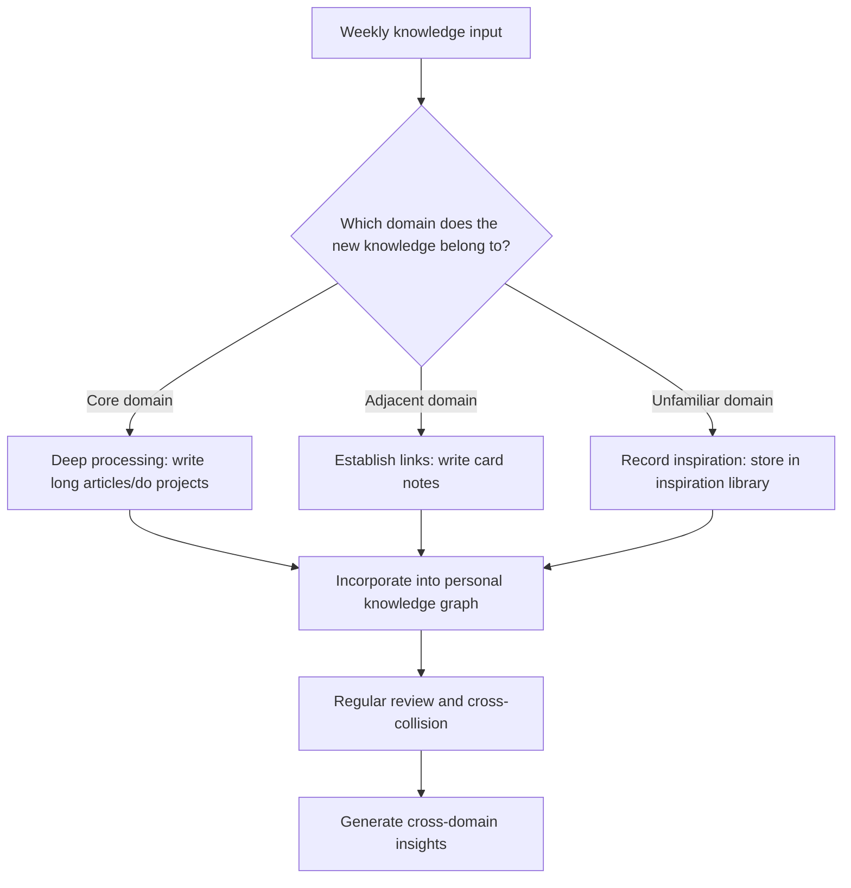
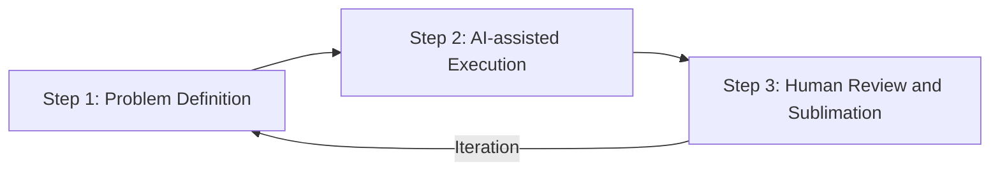
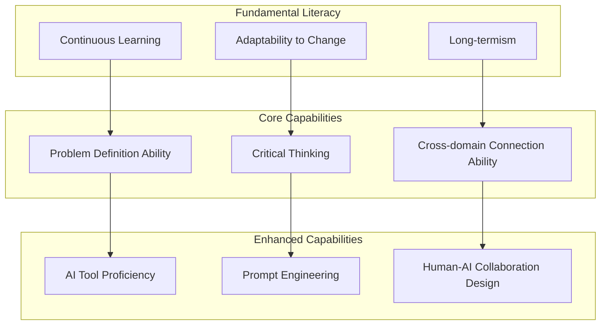

## Introduction

In today's world where AI tools are increasingly widespread, knowledge workers face unprecedented challenges. When ChatGPT can generate a report in seconds, and Midjourney can create an illustration in minutes, what is our core competitive advantage as humans?

This is not a new question, but the leap in large model capabilities in 2025-2026 has made it extremely urgent. Tools like Claude, GPT-4o, and Gemini can already complete work that previously took days to deliver. Anxiety is normal in the face of this impact, but what's needed after anxiety is **systematic thinking** and **executable strategies**.

This article will explore the survival strategies for knowledge workers in the AI era from three core dimensions, combined with specific cases and actionable methodologies.

## Core Insights

### 1. From "Knowledge Reserve" to "Knowledge Connection"

AI excels at retrieving and reorganizing existing knowledge. Given a clear question, it can extract, integrate, and generate structured answers from vast amounts of data in seconds. But AI's limitation is: it can only operate within the boundaries of existing knowledge, unable to truly achieve "cross-domain insights" — that kind of leap thinking that collides evolutionary theory in biology with iterative thinking in product design to create new sparks.

**Concrete case:** A product manager designing a user growth strategy who only relies on AI to search for "growth hacking methodologies" will only get a rearrangement of existing strategies. But if they also have a background in behavioral economics, they can integrate the "loss aversion" psychological mechanism into growth strategy design — for example, changing free trials to "limited-time experiences" to use users' fear of "losing" to increase conversion rates. This cross-domain connection is something AI currently struggles to do independently.

**Methodology: T-shaped Knowledge Structure**

In the AI era, breadth of knowledge is more valuable than depth. It is recommended to adopt a T-shaped knowledge structure:

- **Horizontal (breadth):** Each quarter, deeply understand at least one field unrelated to your main business. You don't need to be an expert, but you need to understand its core thinking models. Recommended reading: the "Multiple Mental Models" chapter in _Poor Charlie's Almanack_.
- **Vertical (depth):** Maintain 2-3 specialized skills in your core field that are difficult for AI to replace, such as complex system architecture design, high-difficulty negotiations, and creative problem definition.

**Actionable suggestions:**

1. **Establish a "Knowledge Collision Diary":** Spend 30 minutes each week randomly selecting two unrelated topics from your note library and forcing yourself to think about the connections between them.
2. **Use bidirectional linking tools:** Such as [Obsidian](/en/blog/notion-obsidian-dual-track) or Logseq, allowing implicit connections between knowledge to naturally emerge.
3. **Participate in cross-domain communities:** Don't just mingle in your industry circle, regularly attend sharing sessions or online communities in other fields.

### 2. From "Efficiency First" to "Value Orientation"

Not everything needs to be done faster. Some things are worth spending more time on because they carry the unique depth of human thinking. AI has made "fast" cheap, so "slow" has become a scarce commodity.

**Concrete case:** A market analysis report generated by AI in 5 minutes and a report produced by an analyst after a week of in-depth interviews and data cross-validation may not differ much in "information quantity," but there is a world of difference in "insight quality" and "credibility." The former is suitable for quickly understanding the overview, while the latter is suitable for making key decisions. The question is: Do you clearly know which one you need at the moment?

**Methodology: Task Value Matrix**

Classify your work according to two dimensions: "AI replaceability" and "value impact":

| Quadrant                         | Characteristics                         | Strategy                                     | Examples                                                  |
| -------------------------------- | --------------------------------------- | -------------------------------------------- | --------------------------------------------------------- |
| High value / Low replaceability  | Requires human judgment and creativity  | Invest more time, polish deeply              | Strategic planning, key decisions, creative concepting    |
| High value / High replaceability | AI can assist but needs human oversight | Use AI to accelerate, human review           | Data analysis drafts, code generation, copywriting drafts |
| Low value / Low replaceability   | Tedious but AI can't do well yet        | Find automation solutions, gradually replace | Format conversion, data cleaning                          |
| Low value / High replaceability  | AI can already do well                  | Immediately hand over to AI                  | Meeting minutes, email replies, information retrieval     |

**Actionable suggestions:**

1. **Do a "time audit" every week:** Record where you spend your time each day, marking which tasks can be handed over to AI and which must be done personally.
2. **Establish "deep work periods" for high-value tasks:** Reserve at least 2 hours of uninterrupted time each day for work that requires deep thinking. Reference Cal Newport's _Deep Work_.
3. **Establish an "AI first" principle:** When receiving any new task, first ask yourself "Can AI complete 80% of it?" If yes, let AI do the first draft, and you do the final 20% refinement.

### 3. From "Individual Hero" to "Human-AI Collaboration"

The best knowledge workers are not those who reject AI, nor those who completely rely on AI, but those who are good at combining human judgment with AI capabilities. These people we call "AI-enhanced knowledge workers."

**Concrete case:** The software development field has provided the best demonstration. After GitHub Copilot was released, it didn't replace programmers, but instead increased the productivity of excellent programmers by 40-55%. The key is: programmers are responsible for architecture design, requirement understanding, and code review, while AI is responsible for code generation, bug fix suggestions, and documentation writing. Humans do the "decision layer," AI does the "execution layer."

**Methodology: Human-AI Collaboration Three-Step Method**

**Step 1: Problem Definition (Human-led)**

This is the most critical and easily overlooked step. The quality of AI output directly depends on the quality of your questions.

- **Bad question:** "Help me write an article about AI"
- **Good question:** "I need a 2000-word article for product managers with 3-5 years of work experience, on the topic 'How to integrate AI capabilities into product design,' including 3 real cases and an actionable implementation framework"

Tool recommendation: Use a **Prompt template library** to standardize your questioning method. You can establish your own Prompt template library in Notion or Obsidian, stored by scenario.

**Step 2: AI-assisted Execution (AI-led)**

Hand over the defined task to AI and let it quickly produce a first draft. Key techniques:

- **Step-by-step instructions:** Don't give all requirements at once, but guide AI to complete them step by step.
- **Provide context:** Give AI enough background information, including target audience, existing materials, desired style, etc.
- **Multi-round dialogue:** Treat AI as a smart intern, gradually optimizing output through multi-round dialogue.

**Step 3: Human Review and Sublimation (Human-led)**

This is the step that reflects your core value. When reviewing AI output, focus on the following points:

1. **Factual accuracy:** AI can "hallucinate," so key data and references must be verified.
2. **Logical consistency:** Check if the argument chain is complete and if there are contradictions.
3. **Value increment:** Does AI's output truly solve the problem? Is a key perspective missing?
4. **Personalized polishing:** Add your unique insights, experiences, and style to make the output from "correct" to "excellent."

**Tool recommendations:**

| Tool                    | Purpose                                         | Recommendation reason                                                             |
| ----------------------- | ----------------------------------------------- | --------------------------------------------------------------------------------- |
| Claude / GPT-4o         | General text generation and reasoning           | Strong long text understanding ability, suitable for complex tasks                |
| Perplexity              | Real-time information retrieval and integration | Automatically comes with source references, reducing hallucinations               |
| GitHub Copilot / Cursor | Code generation and assisted programming        | Deep integration with development environment, significant efficiency improvement |
| Midjourney / DALL-E     | Image generation and design assistance          | Quickly produce visual prototypes, lowering design threshold                      |
| Notion AI               | Document collaboration and knowledge management | Seamless integration with existing workflows                                      |

## New Capability Model for Knowledge Workers

Combining the above three dimensions, knowledge workers in the AI era need to build a new capability model:

## Conclusion

The AI era is not the end of knowledge workers, but the beginning of redefining value. Knowledge workers who can establish unique knowledge connections, adhere to value orientation, and make good use of human-AI collaboration will not only not be eliminated but will embrace unprecedented opportunities.

> "In the AI era, the most scarce is not information, but judgment; not speed, but direction; not efficiency, but meaning."

Adhere to human ontological value and embrace long-termism. Instead of worrying about being replaced by AI, spend time thinking: **What is the only thing you can do?** Invest more time in these things and let AI help you handle everything else.

---

_Related reading: [Notion + Obsidian Dual-track Knowledge Management System](/en/blog/notion-obsidian-dual-track) — Building your personal knowledge management infrastructure_
