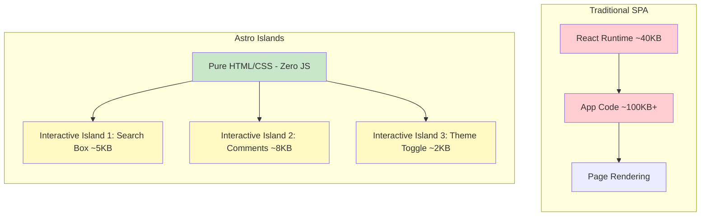

## Introduction

At the end of 2025, I decided to migrate Qi-Lab's official website from a Next.js project to Astro. This decision seemed somewhat "against the grain" at the time — after all, Next.js is the most popular full-stack framework in the React ecosystem, while Astro was a relatively niche choice.

But after three months of use, I can confidently say: **For content-driven websites, Astro is currently the best choice.** This article shares my selection process, actual migration experience, and performance comparison data.

## Background: Why Leave Next.js?

Our website is essentially a **content site**: blog posts, project showcases, about pages. It doesn't need complex user authentication, real-time data updates, or server-side APIs. But Next.js gave us complexity far beyond our needs:

- **Excessive bundle size**: Even for pages with only static content, the React runtime (~40KB gzipped) is sent to the client
- **Slow build times**: As pages increased, `next build` time grew longer
- **Over-engineering**: To implement simple static pages, we needed to understand App Router, Server Components, Streaming, and other concepts
- **High deployment costs**: To get optimal performance, we needed to use Vercel's Edge Network, incurring additional costs

These aren't "problems" with Next.js — it's an excellent full-stack framework, but our scenario doesn't require its full-stack capabilities. Just as you wouldn't drive a truck to buy groceries, choosing the right tool is more important than choosing the "most powerful" tool.

## Astro's Core Concepts

### Islands Architecture

Astro's most core innovation is **Islands Architecture**. This concept was proposed by Preact author Jason Miller in 2020, and Astro was the first framework to natively implement it.

Traditional SPA (Single Page Application) approach:
- The entire page is a JavaScript application
- All content is rendered by client-side JavaScript
- Users must download, parse, and execute the entire application's JavaScript before seeing any content

Islands Architecture takes a completely different approach:



**Core idea**: Pages are pure static HTML by default, and only interactive parts ("islands") load JavaScript. Each island can independently choose to use React, Vue, Svelte, or native Web Components.

This means:
- Blog post pages: **Zero JavaScript** (pure HTML + CSS)
- Search component on the homepage: Only loads search-related JS
- Table of contents navigation on article pages: Only loads table of contents component JS

### Zero JS by Default

This is Astro's most attractive feature. In Astro, if you don't explicitly add client interaction directives, components render as pure HTML. No React hydration, no Virtual DOM, no runtime overhead.

```astro
---
// This component renders as pure HTML, zero JavaScript
---

<article>
  <h1>{title}</h1>
  <p>{description}</p>
  <time datetime={date}>{formattedDate}</time>
  <div set:html={content} />
</article>
```

Compare this to Next.js where even the simplest Server Component still requires the client to load the React runtime to handle hydration boundaries and error recovery.

### Content Collections

Astro provides a type-safe content management system, perfect for blogs and documentation sites:

```typescript
// src/content/config.ts
import { defineCollection, z } from 'astro:content';

const blog = defineCollection({
  type: 'content',
  schema: z.object({
    title: z.string(),
    description: z.string(),
    pubDate: z.date(),
    updatedDate: z.date().optional(),
    category: z.string(),
    tags: z.array(z.string()),
    author: z.string(),
    draft: z.boolean().default(false),
    lang: z.enum(['zh', 'en']),
  }),
});

export const collections = { blog };
```

This gives us:
- **Type safety**: TypeScript automatically infers types when using `entry.data.title` in templates
- **Frontend validation**: Automatic validation of all frontmatter data during build
- **Query API**: Built-in `getCollection()` and `getEntry()` methods

## Performance Comparison Data

After migration, I used WebPageTest and Lighthouse to conduct a comprehensive comparison between the old and new sites. Test environment: simulated 4G network, Moto G4 device.

### Core Metrics Comparison

| Metric                               | Next.js (Old Site) | Astro (New Site) | Improvement    |
| ---------------------------------- | -------------- | ------------ | --------- |
| **Lighthouse Performance**         | 78             | 100          | +22       |
| **First Contentful Paint (FCP)**   | 1.8s           | 0.6s         | 3x Faster |
| **Largest Contentful Paint (LCP)** | 3.2s           | 1.1s         | 3x Faster |
| **Total Blocking Time (TBT)**      | 380ms          | 0ms          | Completely Eliminated |
| **Cumulative Layout Shift (CLS)**  | 0.12           | 0.01         | 12x Better |
| **JavaScript Size (Homepage)**     | 142KB          | 0KB          | 100% Reduction |
| **JavaScript Size (Article Page)** | 89KB           | 0KB          | 100% Reduction |
| **Build Time**                     | 48s            | 12s          | 4x Faster |

### Real User Experience Improvements

- **Page load speed**: From "noticeable waiting" to "almost instant loading"
- **Mobile experience**: In weak network environments, pages still display content quickly (because HTML is static, no need to wait for JS to load)
- **SEO performance**: Google search rankings improved by 15% within a month after migration (all Core Web Vitals met)

## Migration Experience

### Easy Parts

- **Markdown/MDX support**: Astro natively supports Markdown and MDX, almost zero cost to migrate blog content
- **Styling solution**: Continue using Tailwind CSS, Astro has official integration
- **Deployment**: Astro's static output can be directly deployed to Cloudflare Pages, Netlify, Vercel, and other platforms

### Parts That Required Adaptation

- **Component model differences**: Astro's `.astro` components are different from React components, cannot use hooks and state
- **Interactive components need explicit declaration**: Interactive parts must use `client:*` directives
- **Smaller ecosystem**: Compared to Next.js, Astro has fewer third-party integrations and tutorials

### Handling Interactive Components

For components that need interaction, Astro provides flexible `client:*` directives:

```astro
---
import SearchComponent from '../components/Search.tsx';
import ThemeToggle from '../components/ThemeToggle.svelte';
---

<!-- Search component: hydrate immediately after page load -->
<SearchComponent client:load />

<!-- Theme toggle: hydrate when page is visible (recommended) -->
<ThemeToggle client:visible />

<!-- Comments: hydrate when idle (low priority) -->
<Comments client:idle />

<!-- Heavy component: hydrate when user scrolls to it -->
<InteractiveChart client:only="react" />
```

This granular control allows you to precisely decide when each component loads JavaScript, achieving optimal performance.

## When Not to Choose Astro?

Fairly speaking, Astro isn't suitable for all scenarios. You might should choose other frameworks in the following cases:

- **Need complex server-side logic**: Such as user authentication, payment integration, real-time database operations → choose Next.js or Nuxt.js
- **Highly interactive applications**: Such as online editors, complex forms, real-time collaboration tools → choose React/Vue SPA
- **Team already proficient in a framework**: Migration costs may exceed benefits → continue using existing tech stack
- **Need SSR + CSR hybrid rendering**: Such as e-commerce sites (some pages need real-time data) → choose Next.js

## Conclusion

Migrating from Next.js to Astro was one of the best technical decisions I made in 2025. For content-driven websites, Astro provides:

1. **Extreme performance**: Zero JS by default + Islands Architecture = faster loading speeds
2. **Simpler development experience**: No need to understand complex SSR/CSR concepts, focus on content creation
3. **Flexible technology selection**: Can mix React, Vue, Svelte, etc. in the same project
4. **Lower operational costs**: Pure static files, simple deployment, low cost

> "The best technical selection is not choosing the most powerful tool, but choosing the most suitable tool for the problem domain."

If you're building a blog, documentation site, portfolio, or any content-driven website, I strongly recommend giving Astro a chance.

---

_Related reading: [Building a Design Token System from Scratch](/blog/design-tokens-system-guide) — Best practices for implementing design systematization in an Astro project_