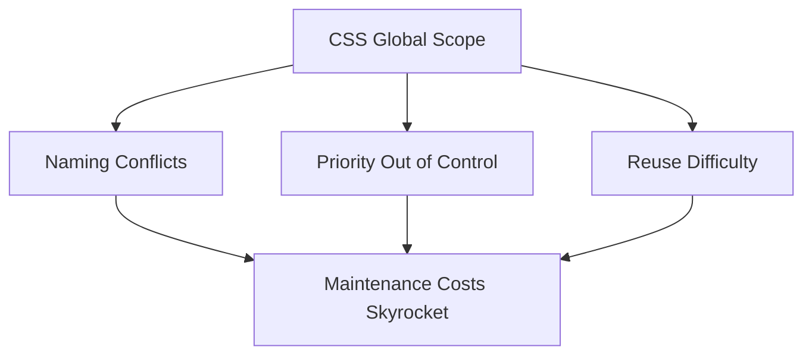
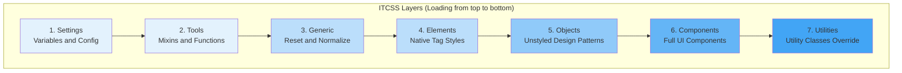
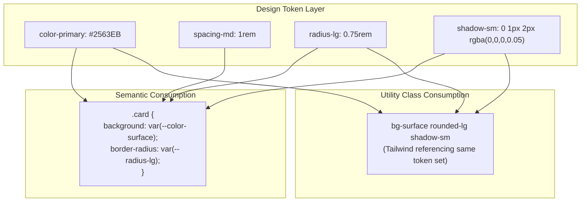
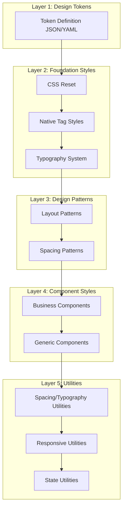
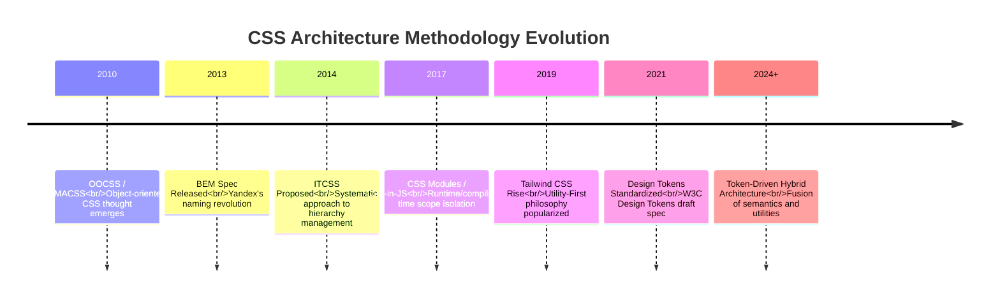

## Introduction

Every frontend developer has experienced this nightmare: opening a two-year-old project, finding that `main.css` has ballooned to over 8000 lines, carefully investigating over 20 selector priority conflicts just to change a button's color, and `!important` scattered throughout the codebase like weeds.

CSS seems simple, but as project scale grows, its two major issues—"global pollution" and "priority chaos"—drastically amplify maintenance costs. Over the past decade, the frontend community has developed various CSS architecture methodologies to address these challenges. This article will trace the evolution from BEM to Design Tokens, helping you find the right CSS organization strategy for medium-to-large projects.

## Core Challenges of CSS Architecture

Before diving into methodologies, let's clarify the three core issues that CSS architecture needs to solve:

1. **Naming Conflicts**: Same-name class selectors from different modules overwrite each other in global scope
2. **Priority Out of Control**: Nested selectors stack layer upon layer, forcing you to rely on `!important` for coverage
3. **Reuse Difficulty**: Styles are strongly coupled with components, making cross-project reuse nearly impossible



Understanding these three pain points helps you better understand what each methodology is trying to solve.

## BEM: The Cornerstone of Naming Conventions

### Core Idea

BEM (Block Element Modifier) was proposed by the Yandex team and is the most classic CSS naming convention. It solves naming conflicts and priority issues through strict naming conventions.

- **Block**: Independent UI functional unit, such as `card`, `menu`, `button`
- **Element**: Component part of a block, connected with double underscores, such as `card__title`, `menu__item`
- **Modifier**: Appearance variation of a block or element, connected with double hyphens, such as `card--featured`, `button--primary`

### Practice Example

```html
<!-- HTML structure with BEM naming -->
<div class="card card--featured">
  
  <div class="card__body">
    <h3 class="card__title">Article Title</h3>
    <p class="card__description card__description--truncated">Article summary content...</p>
    <div class="card__actions">
      <button class="card__btn card__btn--primary">Read More</button>
    </div>
  </div>
</div>
```

```css
/* CSS in BEM style */
.card {
  background: var(--color-surface);
  border: 1px solid var(--color-border);
  border-radius: var(--radius-lg);
  overflow: hidden;
}

.card--featured {
  border-color: var(--color-primary);
  box-shadow: var(--shadow-md);
}

.card__title {
  font-size: var(--font-size-xl);
  font-weight: var(--font-weight-bold);
  color: var(--color-text);
  margin: 0 0 var(--spacing-2);
}

.card__description--truncated {
  display: -webkit-box;
  -webkit-line-clamp: 3;
  -webkit-box-orient: vertical;
  overflow: hidden;
}
```

### Advantages and Limitations of BEM

| Advantages                           | Limitations                   |
| ----------------------------------- | ----------------------------- |
| Self-explanatory names, reduce communication costs | Longer class names, HTML redundancy |
| Flat selectors naturally, avoids priority issues | Limited expressiveness for complex nested components |
| Team-friendly, clear naming rules | Lacks native support for theme switching |
| Works well with preprocessors (Sass/Less) | Doesn't solve cross-project style reuse issues |

> **Practice Recommendation**: BEM's core value lies in "flat selectors". Even if you don't strictly follow BEM's naming format, you should adhere to the "one-level-deep class name" principle, avoiding nested selectors like `.card .body .title`.

## ITCSS: The Wisdom of Hierarchy Management

### Core Idea

ITCSS (Inverted Triangle CSS) was proposed by Harry Roberts and addresses the issue of CSS file organization order. It arranges styles in order of "specificity from low to high", forming an inverted triangle structure.



### Detailed Layers

```scss
// 1. Settings — Design variables (don't output CSS)
$color-primary: #2563eb;
$color-text: #111827;
$spacing-base: 1rem;

// 2. Tools — Sass mixins and functions (don't output CSS)
@mixin respond-to($breakpoint) {
  @if $breakpoint == 'md' {
    @media (min-width: 768px) {
      @content;
    }
  }
}

// 3. Generic — Reset and normalize
@import 'normalize';
*,
*::before,
*::after {
  box-sizing: border-box;
}

// 4. Elements — Native HTML tag styles
h1,
h2,
h3 {
  line-height: 1.25;
}
a {
  color: $color-primary;
  text-decoration: none;
}
img {
  max-width: 100%;
  display: block;
}

// 5. Objects — Design patterns without visual decoration (like grids, containers)
.grid {
  display: grid;
  gap: $spacing-base;
}
.container {
  max-width: 1200px;
  margin: 0 auto;
  padding: 0 $spacing-base;
}

// 6. Components — Complete UI components
.card {
  /* ... */
}
.button {
  /* ... */
}
.nav {
  /* ... */
}

// 7. Utilities — High priority utility classes
.u-hidden {
  display: none !important;
}
.u-text-center {
  text-align: center !important;
}
.u-mt-4 {
  margin-top: $spacing-base !important;
}
```

### The Value of ITCSS

ITCSS's core insight is: **Style loading order determines the outcome of specificity conflicts**. By placing lower specificity styles first and higher specificity later, you can achieve predictable override behavior without using `!important`.

> **Practice Recommendation**: ITCSS doesn't require strict adherence to all seven layers. For small-to-medium projects, simplifying to "variables → reset → components → utilities" four layers is sufficient. The key principle is: **Lower specificity first, higher specificity later**.

## Utility-First: The Ultimate Pursuit of Efficiency

### Core Idea

Utility-First (represented by Tailwind CSS) completely changes how CSS is written: instead of writing custom styles for each component, you build interfaces by combining atomic utility classes.

```html
<!-- Traditional approach: Custom CSS classes -->
<div class="card">
  <h2 class="card__title">Title</h2>
  <p class="card__text">Content</p>
</div>

<!-- Utility-First approach -->
<div
  class="bg-white border border-gray-200 rounded-lg p-6 shadow-sm hover:shadow-md transition-shadow"
>
  <h2 class="text-xl font-bold text-gray-900 mb-2">Title</h2>
  <p class="text-gray-600 text-sm leading-relaxed">Content</p>
</div>
```

### Utility-First vs Semantic CSS

This is one of the most debated topics in the frontend community in recent years. Let's compare objectively:

| Dimension             | Utility-First               | Semantic CSS (BEM etc.)      |
| --------------------- | ---------------------------- | --------------------------- |
| **Development Speed** | Fast, no need to switch files | Slower, need to write and reference CSS |
| **HTML Readability**  | Long class names, structure not intuitive | Semantic class names, structure clear at a glance |
| **Design Consistency**| Naturally consistent (share same utility set) | Requires consciously following design specifications |
| **Learning Curve**    | Need to remember many utility names | Naming conventions simple and intuitive |
| **CSS Bundle Size**   | Pruned on demand, size controllable | Depends on writing quality, prone to redundancy |
| **Refactoring Cost**  | Low, directly modify HTML class names | High, may need to synchronously modify CSS |
| **Design System Fit** | Unified management through config files | Unified management through variables and mixins |
| **Team Collaboration**| High fidelity to design drafts | Requires alignment between design and development |

### Concerns About Utility-First

Utility-First is not a silver bullet. In real projects, it has several issues to note:

1. **HTML Bloat**: A complex component may require a dozen class names, making HTML verbose
2. **Abstraction Leakage**: Style details exposed in HTML, violating separation of concerns
3. **Responsive Complexity**: Many `sm:`, `md:`, `lg:` prefixes making HTML harder to read

```html
<!-- Example of over-using utility classes -->
<div
  class="flex items-center justify-between px-4 sm:px-6 lg:px-8 py-3 sm:py-4
            bg-white dark:bg-gray-900 border-b border-gray-200 dark:border-gray-700
            sticky top-0 z-50 backdrop-blur-sm bg-white/80 dark:bg-gray-900/80"
>
  <!-- This HTML is hard to quickly understand semantically -->
</div>
```

## Design Tokens: The Bridge That Unifies Both

### From Opposition to Fusion

The debate between Utility-First and semantic CSS is essentially a trade-off between "efficiency" and "maintainability". And **Design Tokens** provide an idea for fusing both: use design tokens to define semantic design decisions, and utility classes or component classes to consume these tokens.



### Fusion Strategies in Real Projects

Using design tokens with Tailwind:

```javascript
// tailwind.config.js — mapping design tokens to Tailwind
export default {
  theme: {
    extend: {
      colors: {
        // Alias tokens (semantic)
        primary: 'var(--color-primary)',
        'primary-hover': 'var(--color-primary-hover)',
        surface: 'var(--color-surface)',
        background: 'var(--color-background)',
        text: {
          DEFAULT: 'var(--color-text)',
          muted: 'var(--color-text-muted)',
        },
        border: 'var(--color-border)',
      },
      spacing: {
        // Defining spacing with design tokens
        4: 'var(--spacing-4)',
        6: 'var(--spacing-6)',
        8: 'var(--spacing-8)',
      },
      borderRadius: {
        md: 'var(--radius-md)',
        lg: 'var(--radius-lg)',
      },
    },
  },
};
```

This way, whether using semantic component classes or utility classes, the underlying layer references the same set of design tokens. When changing themes, you only need to update the token values, and all consumers automatically take effect.

> **Further Reading**: For a complete approach to building design tokens, please refer to [Building a Design Token System from Scratch](/blog/design-tokens-system-guide).

## CSS Organization Strategies in Real Projects

Based on the above methodologies, I recommend a layered CSS architecture suitable for medium-to-large projects:



### File Organization Structure

```
src/styles/
├── tokens/           # Design tokens
│   ├── colors.json
│   ├── typography.json
│   └── spacing.json
├── foundations/       # Foundation styles
│   ├── reset.css
│   ├── elements.css
│   └── typography.css
├── patterns/         # Design patterns
│   ├── grid.css
│   └── container.css
├── components/       # Component styles
│   ├── card.css
│   ├── button.css
│   └── nav.css
└── utilities/        # Utilities
    ├── spacing.css
    └── responsive.css
```

### Core Principles

1. **Token Driven**: All design values managed through tokens, components and utilities consume tokens rather than hard-coded values
2. **Component First**: Frequently reused UI patterns encapsulated as component classes, one-off layouts using utility classes
3. **One-way Dependency**: Upper layers can reference lower layers, lower layers cannot reference upper layers. Components can reference tokens and foundation styles, but not utilities
4. **Progressive Enhancement**: New projects can start with Utility-First, gradually extracting semantic component classes as the component library matures

## Methodology Evolution Summary

| Methodology        | Core Issues Solved         | Scenarios              | Limitations               |
| ------------------ | -------------------------- | --------------------- | ------------------------- |
| **BEM**           | Naming conflicts and priority | Projects needing semantic class names | Long class names, lacks theme support |
| **ITCSS**         | Style loading order and organization | File organization for medium-to-large projects | Heavy layering, high learning cost |
| **Utility-First** | Development efficiency and design consistency | Rapidly iterating projects | HTML bloat, abstraction leakage |
| **Design Tokens** | Unified design decision management | Projects needing multiple themes/cross-platform | Requires toolchain support |



## Conclusion

There is no silver bullet for CSS architecture. BEM solves naming issues, ITCSS solves organization issues, Utility-First solves efficiency issues, and design tokens solve consistency issues. In real projects, the best strategy is often **fusing the strengths of multiple methodologies**: using design tokens to unify design decisions, BEM naming for core components, utility classes for one-off layouts, and ITCSS thinking to organize file loading order.

Which methodology to choose depends on your project scale, team preferences, and iteration rhythm. But regardless of your choice, **establishing a unified CSS architecture specification and sticking to it** is far more important than debating which methodology is "best".

> "Good CSS architecture isn't about choosing one methodology, but understanding the trade-offs of each methodology and making reasonable combinations in your project context."

---

_Related Reading: [Building a Design Token System from Scratch](/blog/design-tokens-system-guide) — A complete guide to building design tokens_
