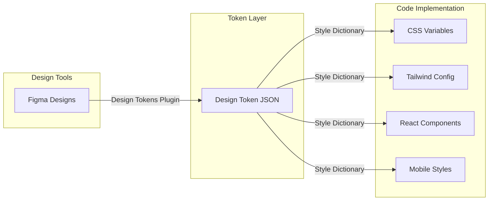
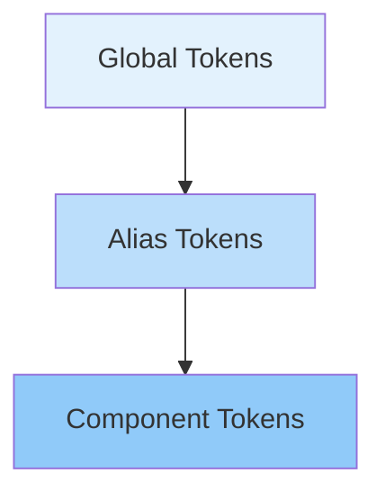

## Introduction

Have you encountered scenarios like these: Designers define a color palette in Figma, but developers use completely different color values in code? During a product redesign, designers update the primary color, but developers need to manually search and replace across files? In dark mode, some components look "not quite right," but no one can pinpoint exactly where the problem is?

These issues all stem from the same root cause: **lacking a unified, maintainable design decision layer.** Design Tokens are exactly the solution to this problem.

## What are Design Tokens?

Design tokens are **the most atomic decision units in a design system.** They are abstract representations of design attributes (colors, fonts, spacing, border radii, shadows, etc.), stored as key-value pairs that can be shared across platforms and tools.

A simple design token looks like this:

```json
{
  "color": {
    "primary": {
      "value": "#2563EB",
      "type": "color",
      "description": "Brand primary color, used for main buttons, links, and key interactive elements"
    }
  }
}
```

The key insight is: **tokens store "decisions" rather than "implementations."** `color.primary` is a design decision ("we need a primary color"), while `#2563EB` is the implementation of that decision in a specific context. When the brand evolves, you only need to modify the token value, and all references will automatically update.



## Why Do We Need Design Tokens?

### 1. Consistency Between Design and Development

When designers and developers use the same set of tokens, "design drift" problems are fundamentally solved. Designers use `color.primary` in Figma, developers reference `--color-primary` in code—both pointing to the same value.

### 2. Multi-Theme Support

Design tokens make theme switching straightforward. You just need to prepare multiple sets of token values and switch at runtime:

```css
/* Light theme */
:root {
  --color-bg: #ffffff;
  --color-text: #1a1a2e;
  --color-primary: #2563eb;
}

/* Dark theme */
[data-theme='dark'] {
  --color-bg: #0f172a;
  --color-text: #e2e8f0;
  --color-primary: #60a5fa;
}
```

### 3. Cross-Platform Consistency

The same set of design tokens can generate code for Web, iOS, and Android platforms, ensuring brand consistency across all touchpoints.

### 4. Maintainability and Scalability

Modify one token value, and all references auto-update. Add a new theme, and you only need a new set of token values—no component code changes required.

## Layered Token Architecture

A mature design token system is typically organized into three layers:



### Layer 1: Global Tokens

These are the lowest-level design values, directly corresponding to raw definitions in the design system. They answer "what it is."

```json
{
  "color": {
    "blue": {
      "50": { "value": "#EFF6FF" },
      "100": { "value": "#DBEAFE" },
      "200": { "value": "#BFDBFE" },
      "300": { "value": "#93C5FD" },
      "400": { "value": "#60A5FA" },
      "500": { "value": "#2563EB" },
      "600": { "value": "#1D4ED8" },
      "700": { "value": "#1E40AF" },
      "800": { "value": "#1E3A8A" },
      "900": { "value": "#172554" }
    },
    "gray": {
      "50": { "value": "#F9FAFB" },
      "100": { "value": "#F3F4F6" },
      "200": { "value": "#E5E7EB" },
      "300": { "value": "#D1D5DB" },
      "400": { "value": "#9CA3AF" },
      "500": { "value": "#6B7280" },
      "600": { "value": "#4B5563" },
      "700": { "value": "#374151" },
      "800": { "value": "#1F2937" },
      "900": { "value": "#111827" }
    }
  }
}
```

### Layer 2: Alias Tokens

Alias tokens give semantic meaning to global tokens. They answer "where it's used."

```json
{
  "color": {
    "primary": { "value": "{color.blue.500}" },
    "primary-hover": { "value": "{color.blue.600}" },
    "secondary": { "value": "{color.gray.500}" },
    "background": { "value": "{color.gray.50}" },
    "surface": { "value": "#FFFFFF" },
    "text": { "value": "{color.gray.900}" },
    "text-muted": { "value": "{color.gray.500}" },
    "border": { "value": "{color.gray.200}" },
    "error": { "value": "#DC2626" },
    "success": { "value": "#16A34A" },
    "warning": { "value": "#D97706" }
  }
}
```

### Layer 3: Component Tokens

Component tokens bind alias tokens to specific component properties. They answer "what value this part of the component should use."

```json
{
  "button": {
    "primary": {
      "bg": { "value": "{color.primary}" },
      "bg-hover": { "value": "{color.primary-hover}" },
      "text": { "value": "#FFFFFF" },
      "border": { "value": "{color.primary}" },
      "radius": { "value": "{spacing.radius.md}" },
      "padding-x": { "value": "{spacing.md}" },
      "padding-y": { "value": "{spacing.sm}" }
    },
    "secondary": {
      "bg": { "value": "transparent" },
      "bg-hover": { "value": "{color.gray.100}" },
      "text": { "value": "{color.primary}" },
      "border": { "value": "{color.primary}" },
      "radius": { "value": "{spacing.radius.md}" },
      "padding-x": { "value": "{spacing.md}" },
      "padding-y": { "value": "{spacing.sm}" }
    }
  }
}
```

## In Practice: Complete Design Token System

Below is a complete token definition covering colors, fonts, spacing, and shadows, along with corresponding CSS variable output.

### Complete Token Definition

```json
{
  "color": {
    "primary": { "value": "#2563EB", "type": "color" },
    "primary-hover": { "value": "#1D4ED8", "type": "color" },
    "secondary": { "value": "#6B7280", "type": "color" },
    "background": { "value": "#F9FAFB", "type": "color" },
    "surface": { "value": "#FFFFFF", "type": "color" },
    "text": { "value": "#111827", "type": "color" },
    "text-muted": { "value": "#6B7280", "type": "color" },
    "border": { "value": "#E5E7EB", "type": "color" },
    "error": { "value": "#DC2626", "type": "color" },
    "success": { "value": "#16A34A", "type": "color" },
    "warning": { "value": "#D97706", "type": "color" }
  },
  "font": {
    "family": {
      "sans": { "value": "'Inter', system-ui, -apple-system, sans-serif", "type": "fontFamily" },
      "mono": { "value": "'JetBrains Mono', 'Fira Code', monospace", "type": "fontFamily" }
    },
    "size": {
      "xs": { "value": "0.75rem", "type": "dimension" },
      "sm": { "value": "0.875rem", "type": "dimension" },
      "base": { "value": "1rem", "type": "dimension" },
      "lg": { "value": "1.125rem", "type": "dimension" },
      "xl": { "value": "1.25rem", "type": "dimension" },
      "2xl": { "value": "1.5rem", "type": "dimension" },
      "3xl": { "value": "1.875rem", "type": "dimension" },
      "4xl": { "value": "2.25rem", "type": "dimension" }
    },
    "weight": {
      "normal": { "value": "400", "type": "fontWeight" },
      "medium": { "value": "500", "type": "fontWeight" },
      "semibold": { "value": "600", "type": "fontWeight" },
      "bold": { "value": "700", "type": "fontWeight" }
    },
    "line-height": {
      "tight": { "value": "1.25", "type": "dimension" },
      "normal": { "value": "1.5", "type": "dimension" },
      "relaxed": { "value": "1.75", "type": "dimension" }
    }
  },
  "spacing": {
    "0": { "value": "0", "type": "dimension" },
    "1": { "value": "0.25rem", "type": "dimension" },
    "2": { "value": "0.5rem", "type": "dimension" },
    "3": { "value": "0.75rem", "type": "dimension" },
    "4": { "value": "1rem", "type": "dimension" },
    "5": { "value": "1.25rem", "type": "dimension" },
    "6": { "value": "1.5rem", "type": "dimension" },
    "8": { "value": "2rem", "type": "dimension" },
    "10": { "value": "2.5rem", "type": "dimension" },
    "12": { "value": "3rem", "type": "dimension" },
    "16": { "value": "4rem", "type": "dimension" },
    "20": { "value": "5rem", "type": "dimension" },
    "24": { "value": "6rem", "type": "dimension" },
    "radius": {
      "sm": { "value": "0.25rem", "type": "dimension" },
      "md": { "value": "0.5rem", "type": "dimension" },
      "lg": { "value": "0.75rem", "type": "dimension" },
      "xl": { "value": "1rem", "type": "dimension" },
      "full": { "value": "9999px", "type": "dimension" }
    }
  },
  "shadow": {
    "sm": { "value": "0 1px 2px 0 rgba(0, 0, 0, 0.05)", "type": "shadow" },
    "md": {
      "value": "0 4px 6px -1px rgba(0, 0, 0, 0.1), 0 2px 4px -2px rgba(0, 0, 0, 0.1)",
      "type": "shadow"
    },
    "lg": {
      "value": "0 10px 15px -3px rgba(0, 0, 0, 0.1), 0 4px 6px -4px rgba(0, 0, 0, 0.1)",
      "type": "shadow"
    },
    "xl": {
      "value": "0 20px 25px -5px rgba(0, 0, 0, 0.1), 0 8px 10px -6px rgba(0, 0, 0, 0.1)",
      "type": "shadow"
    }
  }
}
```

### Generate CSS Variables

Using [Style Dictionary](https://amzn.github.io/style-dictionary/), you can convert token JSON to code for various platforms. Below is the corresponding CSS variable output:

```css
:root {
  /* Colors */
  --color-primary: #2563eb;
  --color-primary-hover: #1d4ed8;
  --color-secondary: #6b7280;
  --color-background: #f9fafb;
  --color-surface: #ffffff;
  --color-text: #111827;
  --color-text-muted: #6b7280;
  --color-border: #e5e7eb;
  --color-error: #dc2626;
  --color-success: #16a34a;
  --color-warning: #d97706;

  /* Font Family */
  --font-sans: 'Inter', system-ui, -apple-system, sans-serif;
  --font-mono: 'JetBrains Mono', 'Fira Code', monospace;

  /* Font Size */
  --font-size-xs: 0.75rem;
  --font-size-sm: 0.875rem;
  --font-size-base: 1rem;
  --font-size-lg: 1.125rem;
  --font-size-xl: 1.25rem;
  --font-size-2xl: 1.5rem;
  --font-size-3xl: 1.875rem;
  --font-size-4xl: 2.25rem;

  /* Spacing */
  --spacing-1: 0.25rem;
  --spacing-2: 0.5rem;
  --spacing-3: 0.75rem;
  --spacing-4: 1rem;
  --spacing-6: 1.5rem;
  --spacing-8: 2rem;
  --spacing-12: 3rem;
  --spacing-16: 4rem;

  /* Border Radius */
  --radius-sm: 0.25rem;
  --radius-md: 0.5rem;
  --radius-lg: 0.75rem;
  --radius-xl: 1rem;
  --radius-full: 9999px;

  /* Shadows */
  --shadow-sm: 0 1px 2px 0 rgba(0, 0, 0, 0.05);
  --shadow-md: 0 4px 6px -1px rgba(0, 0, 0, 0.1), 0 2px 4px -2px rgba(0, 0, 0, 0.1);
  --shadow-lg: 0 10px 15px -3px rgba(0, 0, 0, 0.1), 0 4px 6px -4px rgba(0, 0, 0, 0.1);
  --shadow-xl: 0 20px 25px -5px rgba(0, 0, 0, 0.1), 0 8px 10px -6px rgba(0, 0, 0, 0.1);
}
```

### Using in Components

```css
/* Define component styles with tokens */
.btn {
  display: inline-flex;
  align-items: center;
  justify-content: center;
  padding: var(--spacing-2) var(--spacing-4);
  font-family: var(--font-sans);
  font-size: var(--font-size-sm);
  font-weight: 600;
  line-height: 1;
  border-radius: var(--radius-md);
  border: 1px solid transparent;
  cursor: pointer;
  transition: all 150ms ease;
}

.btn-primary {
  background-color: var(--color-primary);
  color: #ffffff;
}

.btn-primary:hover {
  background-color: var(--color-primary-hover);
}

.btn-secondary {
  background-color: transparent;
  color: var(--color-primary);
  border-color: var(--color-primary);
}

.btn-secondary:hover {
  background-color: var(--color-background);
}

.card {
  background-color: var(--color-surface);
  border: 1px solid var(--color-border);
  border-radius: var(--radius-lg);
  padding: var(--spacing-6);
  box-shadow: var(--shadow-sm);
}

.card:hover {
  box-shadow: var(--shadow-md);
}
```

## Toolchain Recommendations

| Tool                    | Purpose                           | Reason for Recommendation                     |
| ----------------------- | --------------------------------- | --------------------------------------------- |
| **Style Dictionary**    | Token conversion                  | Amazon open source, multi-platform output     |
| **Figma Tokens Studio** | Design-side token management      | Figma plugin, JSON import/export support      |
| **Token Transformer**   | Token format conversion           | Convert between different token formats       |
| **Diez**                | Cross-platform token distribution | Supports iOS/Android/Web unified distribution |
| **Twingate**            | Tailwind integration              | Auto-sync tokens to Tailwind config           |

## Best Practice Summary

1. **Start with alias tokens**: Don't directly use global tokens (like `blue-500`) in components, use semantic alias tokens (like `color-primary`) instead
2. **Hierarchical naming**: Use the `{category}.{property}.{variant}.{state}` naming convention, like `color.primary.hover`
3. **Document each token**: Add descriptions for each token explaining purpose and usage scenarios
4. **Version control**: Include token files in Git version control, review changes via PR process
5. **Automated validation**: Add token format validation in CI to prevent non-compliant tokens from being committed
6. **Progressive adoption**: Don't need to replace all hard-coded values at once, start migrating from new components

## Conclusion

Design tokens aren't "nice-to-have" advanced techniques, but **necessary infrastructure for scalable frontend engineering.** They decouple design decisions from implementation details, making design systems truly maintainable, scalable, and reusable across platforms.

Whether your team is 3 people or 30, whether your project is a simple blog or a complex enterprise app, investing in a design token system is worth it. It not only reduces friction between design and development, but also lays a solid foundation for future theme customization, brand upgrades, and multi-platform adaptation.

> "Design tokens are the atoms of a design system. Atoms are small, but they build the entire material world."

---

_Related Reading: [Why I Chose Astro as Static Site Generator](/blog/astro-ssg-why-i-chose) — The technical foundation for practicing design token systems in an Astro project_
