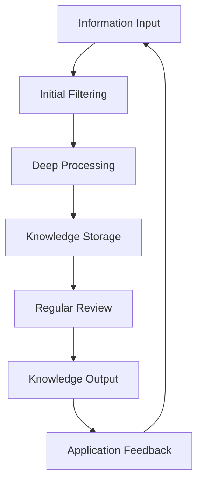

## Introduction

In the age of information explosion, we are surrounded by massive amounts of information every day. From social media posts to work emails and documents, to books and courses during learning, information fragments are everywhere. However, most people only passively receive this information, and few can transform it into true knowledge assets.

This article will provide you with a complete framework to help you build an efficient Personal Knowledge Management (PKM) system, transforming you from an information consumer to a knowledge creator.

## Why Do You Need a Personal Knowledge Management System?

### Three Major Challenges of the Information Age

1. **Information Overload**: The amount of information generated daily far exceeds human processing capacity
2. **Knowledge Fragmentation**: Information is scattered across different platforms, lacking relevance
3. **Memory Decay**: According to the Ebbinghaus Forgetting Curve, we quickly forget most information

### The Value of a Personal Knowledge Management System

- **Improved Learning Efficiency**: Systematic learning, avoiding repetitive work
- **Enhanced Creativity**: Generating new ideas through knowledge connections
- **Better Decision Quality**: Making more informed decisions based on structured knowledge
- **Personal Brand Building**: Outputting high-quality content, establishing professional influence

## The Core Framework of a Personal Knowledge Management System

### 1. Input Layer: Information Acquisition and Filtering

**Principle**: Not all information is worth entering your system

**Practical Methods**:

- **Set Information Sources**: Choose high-quality, goal-relevant information sources
- **Establish Filtering Criteria**: Ask yourself: "Is this information helpful for my goals?"
- **Use Tools**:
  - Read Later: Omnivore, Raindrop
  - Information Aggregation: RSS readers (Feedly)
  - Note Capture: Obsidian, Logseq

**Filtering Matrix**:

| Information Type          | Processing Method  | Example                              |
| ------------------------- | ------------------ | ------------------------------------ |
| High value and relevant   | Deep processing    | Professional books, industry reports |
| Medium value and relevant | Shallow processing | News, blog articles                  |
| Low value or irrelevant   | Directly ignore    | Meaningless social media information |

### 2. Processing Layer: Transforming Information into Knowledge

**Core Task**: Transform raw information into structured, reusable knowledge

**Processing Steps**:

1. **Extract**: Restate core ideas in your own words
2. **Categorize**: Classify knowledge into appropriate topics
3. **Connect**: Establish links with existing knowledge
4. **Store**: Put into knowledge management system

**Recommended Tools**:

- **Obsidian**: Bidirectional links, knowledge graph
- **Notion**: Structured databases, collaboration features
- **Logseq**: Outline-based notes, journal features

### 3. Output Layer: Knowledge Application and Sharing

**Principle**: Knowledge only has value when applied and shared

**Output Forms**:

- **Personal Application**: Solving problems, making decisions
- **Content Creation**: Writing articles, giving presentations
- **Teaching and Sharing**: Tutoring others, online courses
- **Project Practice**: Applying knowledge to actual projects

**Output Tools**:

- Writing: Markdown editors
- Sharing: Blog platforms, social media
- Presentations: Slide tools

## Steps to Build a Personal Knowledge Management System

### Phase 1: Foundation Building (1-2 weeks)

1. **Choose Tools**: Select 1-2 core tools based on personal preference
2. **Establish Basic Structure**: Create folder/tag system
3. **Develop Workflow**: Standard input → processing → output流程
4. **Cultivate Habits**: Spend 30 minutes daily maintaining the system

### Phase 2: Content Accumulation (1-3 months)

1. **Systematic Input**: Read and learn with a plan
2. **Continuous Processing**: Regularly organize and connect knowledge
3. **Start Output**: Try writing blog posts, giving presentations
4. **Collect Feedback**: Adjust the system based on feedback

### Phase 3: System Optimization (After 3 months)

1. **Analyze Usage Data**: Understand which knowledge is most valuable
2. **Optimize Structure**: Adjust classification based on actual usage
3. **Automate Processes**: Use tools to automate repetitive tasks
4. **Expand System**: Add new knowledge domains

## Best Practices for Personal Knowledge Management Systems

### 1. Atomicity Principle

- Each note contains only one core idea
- Keep notes independent and self-contained
- Facilitate future reorganization and reference

### 2. Link Priority

- Actively establish bidirectional links for notes
- Find connections between knowledge
- Build knowledge networks rather than isolated storage

### 3. Regular Review

- **Daily Review**: 5-10 minutes browsing daily notes
- **Weekly Review**: 1 hour organizing and connecting knowledge
- **Monthly Review**: Deep thinking about knowledge system development

### 4. Output-Driven

- Input with output as the goal
- Deepen understanding through writing and sharing
- Build personal knowledge brand

## Common Mistakes and Solutions

### Mistake 1: Pursuing Tool Perfection

**Problem**: Spending大量 time finding and configuring tools, but neglecting content itself

**Solution**:

- Choose one tool and stick with it for 3 months, then adjust based on actual needs

### Mistake 2: Collecting Without Processing

**Problem**: Only collecting information, not conducting deep processing

**Solution**:

- Establish a mandatory "collect → process" flow, set processing deadlines

### Mistake 3: Lack of Output

**Problem**: Knowledge only comes in, not going out, unable to generate value

**Solution**:

- Set regular output goals, such as writing one article per week

### Mistake 4: Overly Complex System

**Problem**: Classification system is too cumbersome, difficult to maintain

**Solution**:

- Keep it simple, adjust as needed, prioritize practicality

## Advanced Techniques for Personal Knowledge Management Systems

### 1. Using MOC (Map of Content)

Create topic index pages as navigation centers for knowledge domains:

```markdown
# Knowledge Management - MOC

## Core Concepts

- [[Knowledge Management Basics]]
- [[Zettelkasten Method]]
- [[Personal Knowledge Graph]]

## Tools and Practice

- [[Obsidian Usage Guide]]
- [[Notion Template Sharing]]
- [[Knowledge Management Workflow]]

## Case Studies

- [[My Knowledge Management System Practice]]
- [[How to Improve Learning Efficiency with PKM]]
```

### 2. Establishing a Knowledge Funnel



### 3. Cross-Domain Knowledge Integration

- Actively find commonalities between different domains of knowledge
- Create cross-domain connection notes
- Think about problems from multiple perspectives

## Conclusion

Building a personal knowledge management system is not a one-time project, but a continuous evolution process. It requires time and effort, but the rewards are enormous — you will have a readily available "second brain" that can help you maintain clear thinking and efficient learning ability in the age of information explosion.

Remember, tools are just means, not ends. What truly matters is your way of thinking and continuous action. Start building your personal knowledge management system now, and let knowledge become your most valuable asset.

---

_Related Reading: [Building a Personal Knowledge Graph: Breaking Free from Linear Folders](/blog/personal-knowledge-graph) — Learn how to build knowledge networks through bidirectional links_

_Related Reading: [Notion + Obsidian Dual-Track Knowledge Management System](/blog/notion-obsidian-dual-track) — Explore tool combination best practices_
