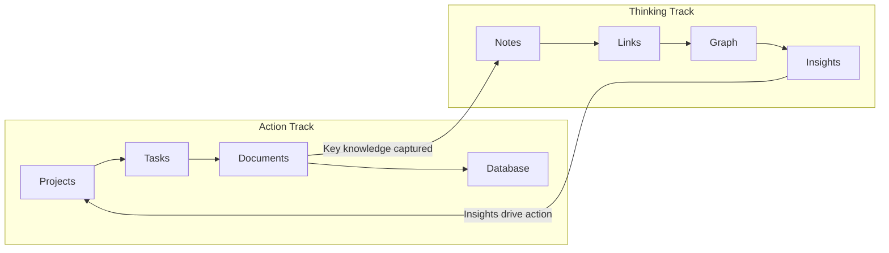
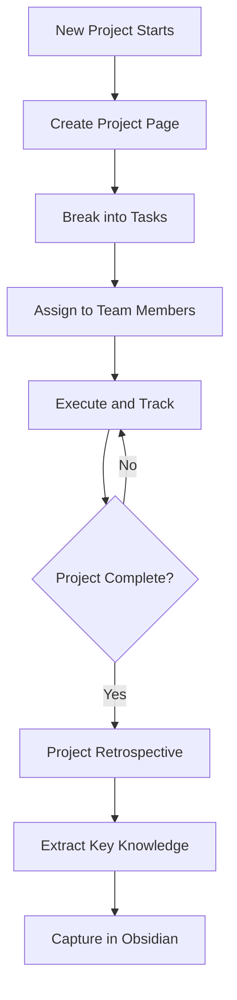
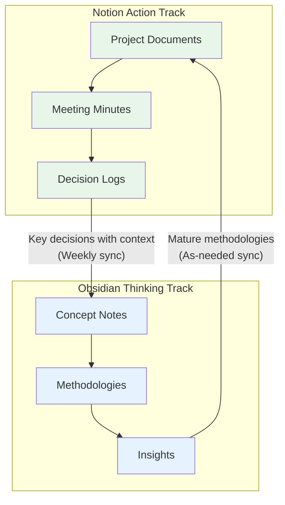

## Why a Dual-Track System?

No single tool can satisfy every need. Notion excels at structured collaboration, while Obsidian shines at personal knowledge graphs. But "two tools" doesn't mean "two systems"—the key is letting each play to its strengths, complementing each other rather than creating information silos.

After over two years of practice and iteration, I've developed a mature dual-track knowledge management methodology. The core idea is:

- **Notion = Action Track**: Manage "what to do" and "how to do it"
- **Obsidian = Thinking Track**: Manage "why" and "what we've learned"



## Notion: The Project Management Track

### Use Cases

- Task tracking and project management
- Team collaboration and knowledge sharing
- Databases and automated workflows
- Customer relationship management (CRM)
- Meeting minutes and decision logs

### Template Design

**1. Project Master Template**

Create a page in Notion for each project with this standard structure:

```markdown
## Project Overview

- **Project Name**:
- **Owner**:
- **Start/End Dates**:
- **Status**: 🟢 In Progress / 🟡 Pending / 🔴 Paused / ✅ Completed
- **Priority**: P0 / P1 / P2

## Goals and Key Results

| OKR | Target | Current | Progress |
| --- | ------ | ------- | -------- |
|     |        |         |          |

## Milestones

- [ ] M1: xxx (Due Date)
- [ ] M2: xxx (Due Date)

## Related Resources

- Requirements Doc:
- Designs:
- Technical Proposal:

## Meeting Minutes

(Auto-aggregated using related databases)

## Knowledge Capture

> What did we learn from this project? → Capture in Obsidian
```

**2. Task Database Template**

Use Notion Database with Board View and Timeline View:

| Field           | Type         | Description                                |
| --------------- | ------------ | ------------------------------------------ |
| Task Name       | Title        | Brief description                          |
| Status          | Select       | Todo / In Progress / Reviewing / Completed |
| Priority        | Select       | P0 Urgent / P1 Important / P2 Normal       |
| Assignee        | Person       | Designated executor                        |
| Due Date        | Date         | Includes reminders                         |
| Parent Project  | Relation     | Link to project page                       |
| Estimated Hours | Number       | For scheduling reference                   |
| Tags            | Multi-select | Categorization tags                        |

**3. Automated Workflows**

Leverage Notion's Button and Automation features:

- Click a button to automatically create "daily standup" pages
- Auto-notify relevant people when task status changes
- Auto-generate "retrospective survey" when project completes

### Workflow



## Obsidian: The Knowledge Capture Track

### Use Cases

- Personal notes and deep thinking
- Knowledge graphs and bidirectional links
- Long-term knowledge accumulation and retrieval
- Reading notes and learning summaries
- Creative inspiration capture

### Template Design

**1. Evergreen Note Template**

```markdown
---
type: evergreen
created: { { date } }
tags: []
related: []
status: seedling
---

# {{title}}

## Core Idea

## Supporting Arguments

## Practical Applications

## To Explore

- [ ]
```

**2. Project Retrospective Template**

```markdown
---
type: review
project: ''
notion_link: ''
created: { { date } }
tags: [Retrospective, Project]
---

# {{title}} - Project Retrospective

## Background and Goals

## What Worked Well

## What Didn't Work Well

## If We Could Do It Again

## Reusable Methodologies

> [!tip] Key Takeaway

## Related Knowledge

- [[Related Note 1]]
- [[Related Note 2]]
```

**3. Literature Note Template**

```markdown
---
type: literature
source: ''
author: ''
created: { { date } }
tags: [Reading Notes]
---

# {{title}}

## One-Sentence Summary

## Key Concepts

1.
2.
3.

## Selected Excerpts

> "Quote content" — Location

## My Thoughts

## Action Items

- [ ]
```

### Essential Plugin Recommendations

| Plugin            | Functionality       | Why You Need It                                                   |
| ----------------- | ------------------- | ----------------------------------------------------------------- |
| Dataview          | Query Notes         | SQL-like syntax to query notes, dynamic views                     |
| Templater         | Advanced Templates  | More flexible than Core Templates, supports variables and scripts |
| Excalidraw        | Hand-Drawn Diagrams | Embed whiteboards in notes, visualize thinking                    |
| Kanban            | Kanban View         | Manage personal task boards in Obsidian                           |
| Calendar          | Calendar View       | Review daily notes by date                                        |
| Readwise Official | Reading Sync        | Auto-sync highlights from Kindle, WeRead, etc.                    |

## Dual-Track Collaboration Strategy

### Synchronization Principles

Information flow between the two systems needs clear rules, otherwise it becomes a burden of "maintaining both":



**Principle 1: Notion → Obsidian — Regular Capture**

- **Frequency**: Once a week, ideally Friday afternoon
- **Content**: Key decisions, lessons learned, valuable methodologies
- **Method**: Create retrospective notes in Obsidian with Notion links as references

**Principle 2: Obsidian → Notion — As-Needed Extraction**

- **Trigger**: When a methodology or insight in Obsidian needs to be applied to a specific project
- **Content**: Mature methodologies, actionable best practices, proven templates
- **Method**: Compile core content from Obsidian notes into Notion's team knowledge base

**Principle 3: Avoid Duplication**

- Don't store "thinking process" in Notion, only "action results"
- Don't store "todo items" in Obsidian, only "knowledge capture"
- If unsure where to put it, ask yourself: "Will I still look back at this in a year?" If yes, Obsidian; if only temporarily needed, Notion

### Sync Tool Recommendations

| Tool                         | Direction         | Use Case                                    |
| ---------------------------- | ----------------- | ------------------------------------------- |
| Manual copy + links          | Bidirectional     | Simplest and most reliable, for light usage |
| Notion API + Obsidian Plugin | Notion → Obsidian | Auto-sync specific databases to Obsidian    |
| Zapier / Make                | Bidirectional     | Automated triggers, for complex workflows   |
| MarkDownload                 | Web → Obsidian    | Save web content as Markdown to Obsidian    |

## Notion vs Obsidian: Full Comparison

| Dimension                  | Notion                                                  | Obsidian                                                 |
| -------------------------- | ------------------------------------------------------- | -------------------------------------------------------- |
| **Data Storage**           | Cloud (vendor-locked)                                   | Local Markdown (data sovereign)                          |
| **Collaboration**          | Strong (real-time multi-user)                           | Weak (needs third-party sync)                            |
| **Structure**              | High (databases, rich views)                            | Low (free text focus)                                    |
| **Knowledge Graph**        | No native support                                       | Core feature (bidirectional links + graph visualization) |
| **Offline Use**            | Limited support                                         | Full support                                             |
| **Plugin Ecosystem**       | Limited (integrations focus)                            | Rich (community-driven, 1500+ plugins)                   |
| **Learning Curve**         | Low (WYSIWYG)                                           | Medium-High (needs understanding of PKM concepts)        |
| **Mobile Experience**      | Excellent                                               | Good (Obsidian Mobile)                                   |
| **Automation**             | Native support                                          | Depends on plugins and scripts                           |
| **Best For**               | Team collaboration, project management, structured data | Personal knowledge management, deep thinking, writing    |
| **Data Security**          | Dependent on vendor                                     | Full control (local + Git)                               |
| **Long-Term Availability** | Dependent on company survival                           | Markdown is open standard, never goes obsolete           |

## Implementation Suggestions

If you also want to build your own dual-track system, I recommend following these steps:

1. **Week 1**: Map your existing knowledge management workflow, clarify which are "action" tasks and which are "thinking" tasks
2. **Week 2**: Build basic project templates and task databases in Notion
3. **Week 3**: Install core plugins in Obsidian, create note templates
4. **Week 4**: Establish synchronization mechanism, start trial run
5. **After 1 Month**: Review and adjust, find the rhythm that works best for you

> **Important Note**: Tools are just means, not ends. Don't build a system just for the sake of building a system. If one tool already meets your needs, you don't need to force a dual-track system. The value of dual-track is solving pain points that a single tool can't cover, not creating more maintenance burden.

## Summary

The essence of the Notion + Obsidian dual-track system is **the separation and unification of "action" and "thinking"**. Notion helps you efficiently "get things done," Obsidian helps you deeply "think things through." The two form a closed loop through regular capture and as-needed extraction, giving your knowledge management both breadth (project management coverage) and depth (knowledge capture quality).

As we mentioned in [A Survival Guide for Knowledge Workers in the AI Era](/blog/ai-era-knowledge-worker), judgment and sense of direction are the scarcest resources in the AI age. A well-functioning knowledge management system is exactly the best soil for cultivating these two abilities.
