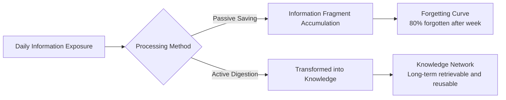
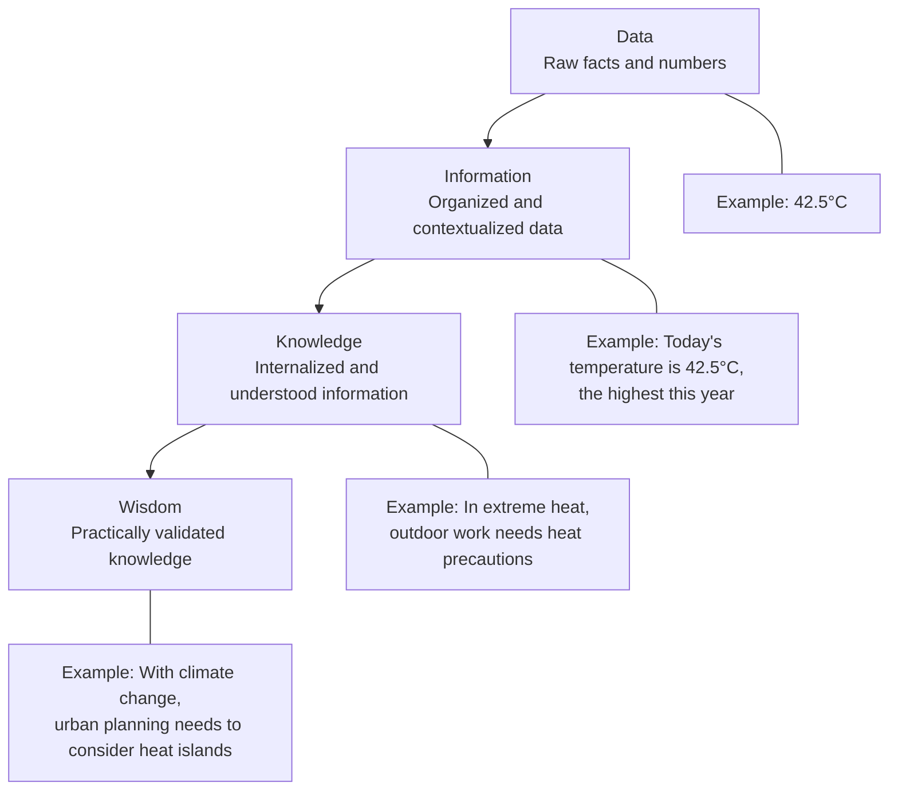
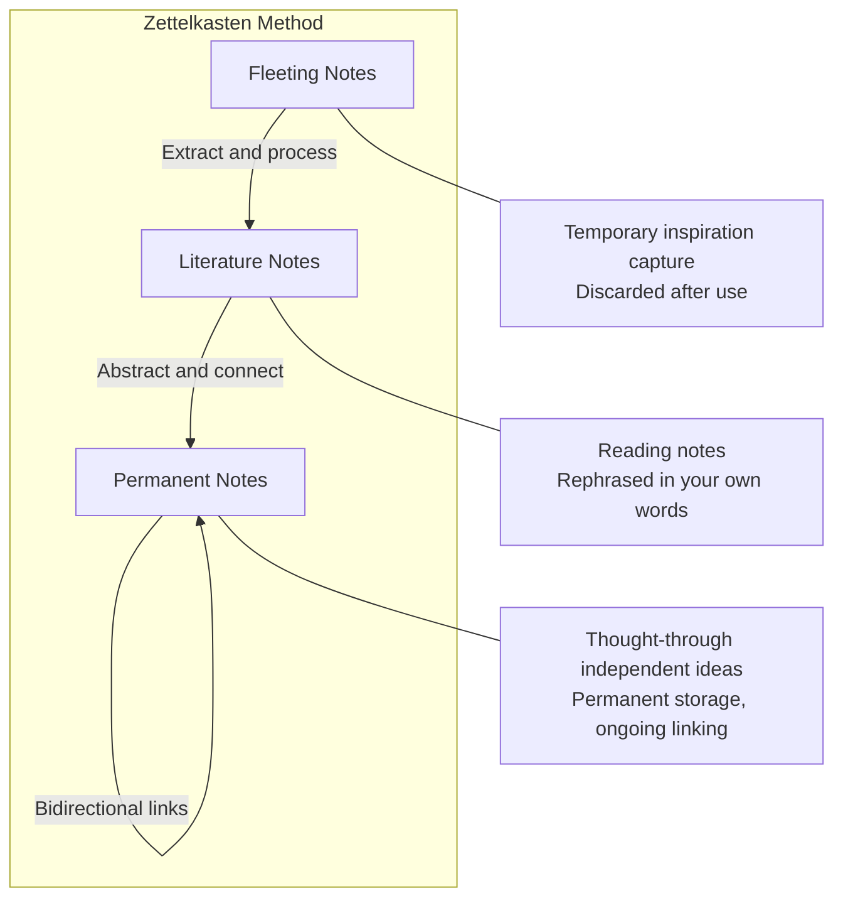
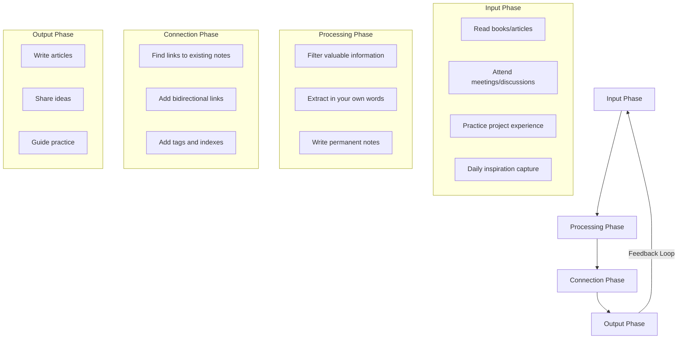
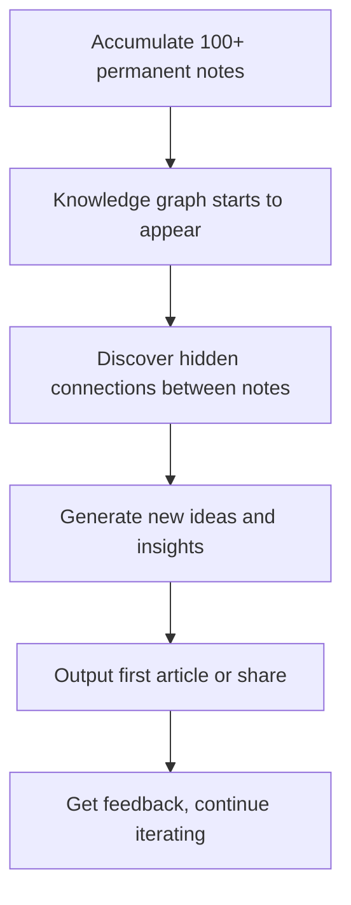

## Introduction

Have you ever had this experience: you read a great article, save it to your bookmarks, and never open it again; you attend an information-packed presentation, take a screen full of photos, and completely forget what it was about a week later; you have a brilliant insight late at night, but can't remember it when you wake up?

This isn't a memory problem—it's a **knowledge management** problem. We consume massive amounts of information every day, but most of it stays in a "save and forget" state—scattered as fragments across browser bookmarks, WeChat saves, note apps, and some corner of your brain, with no connections between them.

This article explores how to systematically transform these information fragments into a structured knowledge network, building your own "second brain."

## The Information Overload Era Dilemma

We live in an era of information abundance but attention scarcity. The amount of information generated daily far exceeds any previous period in human history, while our processing capacity hasn't kept pace.



The Ebbinghaus Forgetting Curve tells us that without active review, we forget about 80% of newly learned knowledge after a week. And the act of "saving" gives us a false sense of security—"I've saved it, so I've mastered it." In reality, saving is just the first step in information storage, and there's still a long way to go before actual knowledge digestion.

## The DIKW Model: From Data to Wisdom

To understand the essence of knowledge management, we first need to understand the hierarchical structure of knowledge. The DIKW model (Data-Information-Knowledge-Wisdom) provides a clear framework:



Most people's information management stays at the "information" level—saving a pile of articles, bookmarks, screenshots, but not further processing them into "knowledge." And the core work of real knowledge management is completing the transformation from Information to Knowledge.

### Key Transformation Steps

1. **Filter**: Not all information is worth keeping. Ask yourself: "What use is this information to me? What problem can it solve?"
2. **Extract**: Rephrase in your own words, strip away redundant information, keep core ideas
3. **Connect**: Establish links between new information and existing knowledge, think "How does this relate to what I already know?"
4. **Apply**: Apply knowledge to practical scenarios, validate and deepen understanding through practice

## The Zettelkasten Method

### Origins and Core Concepts

The Zettelkasten (slip box) method was invented by German sociologist Niklas Luhmann. Luhmann used this method to manage over 90,000 cards, producing more than 70 books and 400+ papers. Its core idea is: **Knowledge doesn't exist in isolation, it forms a network through links**.

Luhmann's success didn't come from his memory or intelligence, but from building a system—a "thinking machine" that could automatically generate new ideas.

### The Three Card Types



**1. Fleeting Notes**

Quickly captured inspirations, ideas, fragments. No need for elaborate organization—the key is rapid capture. Can use phone memos, voice input, or any readily available tool. Fleeting notes have a short lifespan—usually processed or discarded within 1-2 days.

**2. Literature Notes**

Notes taken while reading books or articles. The key principle is **rephrasing in your own words**, not simple copy-paste. Each literature note records only one idea and cites its source.

```markdown
---
type: literature
source: 'How to Take Smart Notes'
author: 'Sönke Ahrens'
created: 2026-03-15
tags: [Reading Notes, Knowledge Management]
---

# How to Take Smart Notes - Literature Note

## Core Idea

Writing isn't the result of thinking, it's the tool for thinking. Luhmann didn't think things through first then write—he thought things through by writing cards.

## My Thoughts

This explains why "writing it out" and "figuring it out" often happen synchronously. Writing itself is a cognitive process, not just output of cognitive results.
```

**3. Permanent Notes**

Independent ideas that have been thought through carefully. Each permanent note is a complete, self-contained unit of thought, written in clear language, with links to other notes. Permanent notes are the "nodes" in the knowledge network.

```markdown
---
type: permanent
created: 2026-03-16
tags: [Writing, Thinking, Cognitive Science]
related: [[Zettelkasten Method]], [[Feynman Technique]]
---

# Writing is Thinking

Writing isn't just a tool for expressing existing ideas—it's a cognitive process in itself. When we try to turn vague intuition into clear words, the brain is forced to carry out precise logical organization and conceptual definition.

This explains several common phenomena:

- "I thought I understood it, but I can't write it out"—meaning understanding isn't deep enough
- "I figure it out as I'm writing it"—writing pushes cognitive deepening
- "Teaching is the best learning"—explaining to others (a form of writing) forces you to clarify logic

**Connection**: This aligns with the core idea of [[Feynman Technique]]—if you can't explain a concept in simple language, you haven't truly understood it.

**Application**: Don't wait until you "have it figured out" to start writing. Write first, and "figure it out" through the process of writing.
```

### Core Principles of Zettelkasten

1. **Atomicity**: Each note contains only one idea. This makes free combination and linking easier
2. **Autonomy**: Write in your own words, don't depend on the original. If you can't rephrase it in your own words, you haven't understood it
3. **Linkability**: Actively establish links for notes. The more links, the richer the knowledge network
4. **No Classification**: Don't use folder classification—let notes organize naturally through links and tags

## How to Build Your Knowledge Graph

### From Notes to Graph

A knowledge graph doesn't happen overnight—it grows naturally as your notes accumulate. But you can accelerate its formation through these methods:



### Three Knowledge Graph Structures

| Structure Type   | Description                                                       | Value                           |
| ---------------- | ----------------------------------------------------------------- | ------------------------------- |
| **Hierarchical** | Parent-child relationships, e.g., "Frontend → CSS → Architecture" | Provides macro framework        |
| **Associative**  | Horizontal connections between topics                             | Generates cross-domain insights |
| **Sequential**   | Timeline or process of knowledge                                  | Shows knowledge evolution path  |

A mature knowledge graph should contain all three structures. Hierarchical structures let you quickly locate knowledge, associative structures help you discover hidden connections, sequential structures let you trace knowledge's origins.

### Tips to Accelerate Graph Growth

1. **Daily Review**: Spend 10 minutes each day browsing recent notes, looking for places to establish links
2. **Index Notes**: Create "entry notes" (MOC, Map of Content) as navigation pages for topics
3. **Regular Organization**: Spend 30 minutes each week cleaning up fleeting notes, extracting valuable ones into permanent notes
4. **Active Questioning**: After reading an article, ask yourself "How does this relate to what I already know?"

```markdown
---
type: moc
created: 2026-04-01
tags: [Index, Knowledge Management]
---

# Knowledge Management - Topic Index

## Core Methods

- [[Zettelkasten Method]] — Luhmann's note system
- [[Feynman Technique]] — Learn by teaching
- [[DIKW Model]] — Hierarchical structure of knowledge

## Tools and Practice

- [[Notion + Obsidian Dual-Track Knowledge Management System]]
- [[Personal Knowledge Graph Construction]]

## Further Reading

- [[A Survival Guide for Knowledge Workers in the AI Era]]
```

## Tool Recommendations

### Core Tools

| Tool          | Type                | Core Advantage                                                  | Best For                                   |
| ------------- | ------------------- | --------------------------------------------------------------- | ------------------------------------------ |
| **Obsidian**  | Local Notes         | Bidirectional links, graph visualization, rich plugin ecosystem | Those who value knowledge network building |
| **Logseq**    | Local Notes         | Outline-based notes, bidirectional links, open source free      | Those who like outline structures          |
| **Notion**    | Cloud Collaboration | Databases, team collaboration, rich templates                   | Those needing team collaboration           |
| **Heptabase** | Visual Notes        | Whiteboard knowledge organization, spatial thinking             | Visual thinkers                            |
| **Readwise**  | Reading Sync        | Auto-sync highlights from various platforms to note tools       | Heavy readers                              |

### Supporting Tools

| Tool             | Purpose         | Notes                                                      |
| ---------------- | --------------- | ---------------------------------------------------------- |
| **Omnivore**     | Read It Later   | Open source free read-it-later tool, supports highlighting |
| **MarkDownload** | Web Saving      | Save web content as Markdown format                        |
| **Dataview**     | Note Query      | Obsidian plugin, query notes with SQL-like syntax          |
| **Excalidraw**   | Visual Thinking | Obsidian plugin, hand-drawn diagrams and mind maps         |

> **Tool Selection Advice**: Don't fall into "tool anxiety." Tools are just carriers—the core is your thinking style. I recommend sticking with one tool (Obsidian recommended) for three months first, then deciding if you need to add other tools based on actual needs. For specific tool pairing solutions, refer to [Notion + Obsidian Dual-Track Knowledge Management System](/blog/notion-obsidian-dual-track).

## Practice Roadmap

If you're ready to start building your own knowledge graph, I recommend following this roadmap:

### Phase 1: Build Habits (Weeks 1-2)


- Choose a note tool and install it
- Create 3 basic templates: fleeting notes, literature notes, permanent notes
- Record at least 3 fleeting notes each day
- Spend 10 minutes each day reviewing and organizing

### Phase 2: Accumulate Notes (Weeks 3-6)

- Start reading systematically, produce at least 3 literature notes per book/article
- Extract valuable literature notes into permanent notes
- Find at least 1 related note for each permanent note
- Create your first topic index (MOC)

### Phase 3: Build Network (Months 2-3)



- Reach 100+ permanent notes
- Regularly browse knowledge graph, discover unexpected connections
- Try outputting an article or share based on note network
- Adjust note method based on feedback

### Phase 4: Continuous Evolution (After Month 3)

- Establish stable input-processing-output loop
- Regularly review and update old permanent notes
- Explore automation tools (Dataview queries, template automation)
- Apply knowledge graph to actual work and learning

## Summary

Building a personal knowledge graph isn't a one-time project—it's a **thinking habit** that requires long-term persistence. Its core isn't tools or methods, but **maintaining an attitude of reverence and curiosity toward knowledge**—every reading, every thought, every practice adds new nodes and connections to your knowledge network.

From information fragments to knowledge network, the key is three transformations: **from passive saving to active extraction**, **from isolated storage to establishing links**, **from knowledge accumulation to practical output**. When you complete these three transformations, you'll have a true "second brain"—a knowledge system that can continuously generate insights and creativity.

> "Knowledge isn't how much information you've saved, it's how many meaningful connections you can establish between different pieces of knowledge."

As we discussed in [A Survival Guide for Knowledge Workers in the AI Era](/blog/ai-era-knowledge-worker), in the age of information overload, real competitiveness doesn't lie in how much information you've mastered, but in whether you can transform information into reusable knowledge and generate unique insights based on it. A personal knowledge graph is exactly the most effective path to achieving this goal.

---

_Related Reading: [Notion + Obsidian Dual-Track Knowledge Management System](/blog/notion-obsidian-dual-track) — Implementation tool solution for knowledge graphs_
