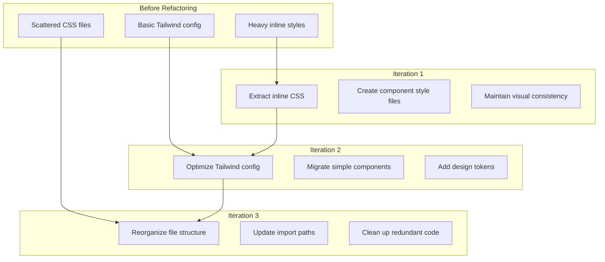

## Introduction

In software development, refactoring is an eternal topic. But the easiest mistake in refactoring is "pursuing perfectionism"—trying to rewrite the entire codebase at once, resulting in project delays or even failure.

This article shares my complete practical experience during the **Qi-Lab website** refactoring: how, through three iterative cycles, I gradually migrated from inline CSS to an optimized Tailwind architecture, what pitfalls I encountered along the way, and how to minimize risk through a progressive strategy.




## Why Choose Progressive Refactoring?

The biggest enemy of refactoring is the temptation of "complete rewrite." After analyzing the project, I discovered three main issues:

| Issue                                                    | Risk   | Why Can't Be Solved At Once                                            |
| -------------------------------------------------------- | ------ | ---------------------------------------------------------------------- |
| Homepage has 170+ lines of inline `<style>`              | High   | Directly removing inline styles would cause large-scale style breakage |
| Multiple components have their own inline styles         | Medium | Migrating one by one takes time but risk is controllable               |
| CSS files are loosely organized, lacking clear structure | Low    | Moving files is relatively safe but requires updating all references   |

**Core Advantages of Progressive Refactoring**:

1. **Risk Isolation**: Each iteration has clear boundaries, error scope is controllable
2. **Rapid Feedback**: Can immediately verify effects after each iteration completes
3. **Pausable**: Can pause at any time if there are other urgent tasks
4. **Learning Opportunity**: Gradually understand best practices through actual operation

## Iteration 1: Extract Inline Styles

### Objective

Extract all inline `<style>` tags from components and pages into external CSS files, maintaining complete visual consistency.

### Execution Process

#### Step 1: Audit Inline Styles

First, I needed to know how many inline styles were actually in the project:

```bash
# Find all .astro files containing <style> tags
grep -r "<style" src/ --include="*.astro"
```

The results showed:

- Homepage (`src/pages/index.astro`): 170 lines of inline styles
- `ThemeToggle.astro`: Complete styles for theme toggle button
- `LanguageToggle.astro`: Language switch component styles
- `DashCard.astro`: Dashboard card component styles

#### Step 2: Create Corresponding CSS Files

I created corresponding CSS files for each component with inline styles:

```css
/* src/styles/page-home.css - Homepage-specific styles */
/* Complete copy of <style> content from index.astro */
```

```css
/* src/styles/component-theme-toggle.css - Theme toggle button styles */
/* Extracted completely from ThemeToggle.astro */
```

#### Step 3: Update Component References

Modify component files, remove inline `<style>`, change to importing external CSS:

```astro
---
// Before
---

<!-- Component content -->
<style>
  /* 100+ lines of inline styles */
</style>

--- // After import "../styles/component-name.css"; ---
<!-- Component content -->
<!-- No more <style> tags -->
```

### Pitfalls Encountered

**Pitfall #1: CSS Scope Lost**
In Astro, inline `<style>` tags are **component-scoped** by default (similar to Vue's scoped). But when extracted to external CSS files, these styles become **global scope**!

**Solution**:

1. Ensure each class name in CSS files has a unique prefix (e.g., `.theme-toggle-*`)
2. Or use Astro's CSS Modules feature (but this requires more changes)
3. We chose the prefix approach because it has lower risk

**Pitfall #2: `@import` Path Issues**
In extracted CSS files, if there are `@import` references, paths need to be recalculated!

**Solution**:

- Ensure all `@import` use relative paths calculated from the file location
- Or directly use paths starting from `src/styles/`

### Acceptance Criteria

- ✅ All inline `<style>` tags have been moved to external files
- ✅ Build succeeds, no style errors
- ✅ Visual effects remain completely consistent (need to verify both light/dark modes)

#### Verification Method

```bash
npm run build
# If build succeeds, it's basically fine!
```

## Iteration 2: Tailwind Integration Optimization

### Objective

Optimize Tailwind configuration, migrate simple components to Tailwind utility classes while maintaining design system consistency.

### Execution Process

#### Step 1: Improve Tailwind Configuration

The original `tailwind.config.mjs` was very basic, only defining a few colors. I significantly expanded it:

```javascript
// tailwind.config.mjs
export default {
  content: ['./src/**/*.{astro,html,js,jsx,md,mdx,svelte,ts,tsx,vue}'],
  theme: {
    extend: {
      // Semantic colors (reference design tokens)
      colors: {
        primary: 'var(--qi-brand-emerald)',
        text: {
          primary: 'var(--qi-text-primary)',
          secondary: 'var(--qi-text-secondary)',
          muted: 'var(--qi-text-muted)',
        },
        bg: {
          base: 'var(--qi-bg-base)',
          surface: 'var(--qi-surface-main)',
        },
        border: {
          default: 'var(--qi-border-default)',
        },
        // Complete color series
        emerald: { 50: '...', 100: '...', /* ... */ 900: '...' },
      },
      // Other design token mappings
      fontFamily: { sans: 'var(--qi-font-sans)' /* ... */ },
      spacing: { xs: 'var(--qi-space-xs)' /* ... */ },
      borderRadius: { md: 'var(--qi-radius-md)' /* ... */ },
      boxShadow: { sm: 'var(--qi-shadow-sm)' /* ... */ },
    },
  },
  plugins: [],
};
```

#### Step 2: Add Custom Component Classes in `tailwind.css`

For styles requiring special animations or complex selectors, I used `@layer components` in `tailwind.css`:

```css
@tailwind base;
@tailwind components;
@tailwind utilities;

@layer components {
  /* Theme toggle button icon animation classes */
  .theme-icon-sun {
    opacity: 0;
    transform: rotate(-90deg) scale(0.5);
  }

  .theme-icon-moon {
    opacity: 1;
    transform: rotate(0deg) scale(1);
  }

  .dark .theme-icon-sun {
    opacity: 1;
    transform: rotate(0deg) scale(1);
  }

  .dark .theme-icon-moon {
    opacity: 0;
    transform: rotate(90deg) scale(0.5);
  }

  /* Animation keyframes */
  @keyframes fillIn {
    from {
      width: 0%;
    }
  }

  @keyframes fadeUp {
    from {
      opacity: 0;
      transform: translateY(4px);
    }
    to {
      opacity: 1;
      transform: translateY(0);
    }
  }

  .animate-fillIn {
    animation: fillIn 1.2s var(--qi-spring) forwards;
  }
  .animate-fadeUp {
    animation: fadeUp 0.5s ease 0.8s forwards;
  }
}
```

#### Step 3: Migrate Components One By One

**ThemeToggle Component Migration**:

```astro
<!-- Before -->
<button class="theme-toggle">...</button>

<!-- After -->
<button
  class="inline-flex items-center justify-center w-8 h-8 p-0 bg-transparent
               border border-[var(--qi-base-06)] rounded-md cursor-pointer
               text-text-secondary hover:text-text-primary
               hover:bg-[var(--qi-base-04)] hover:border-[var(--qi-base-08)]
               focus-visible:outline-none focus-visible:outline-2
               focus-visible:outline-offset-2 focus-visible:outline-primary
               transition-colors duration-fast relative"
>
  ...
</button>
```

**DashCard Component Migration**:
This component was more complex, containing dynamic fill animations. I chose a hybrid approach:

- Layout and basic styles using Tailwind
- Dynamic fill width set via `style` attribute
- Key animation classes defined in `tailwind.css`

### Pitfalls Encountered

**Pitfall #3: Correct Use of Design Tokens in Tailwind**
At first I wrote `bg-qi-brand-emerald` directly, but this didn't work at all!

**Cause**: Tailwind doesn't automatically recognize CSS custom properties as color values.

**Solution**:
Define semantic color aliases in `tailwind.config.mjs`, then use `text-primary`, `bg-primary`, etc.

**Pitfall #4: Animation Performance Issues**
When migrating DashCard, I noticed stuttering in some browsers.

**Cause**: Used `width` property for animation, which triggers reflow.

**Solution**:

1. For simple animations, use `transform` and `opacity` instead
2. For this specific scenario, `width` was necessary, so added `will-change: width` to hint browser optimization
3. Kept original spring easing animation curve to ensure visual consistency

**Pitfall #5: Correct Writing of Dark Mode Class Names**
Tailwind's dark mode works through `dark:` prefix, but need to ensure:

```html
<!-- ❌ Wrong -->
<div class="bg-white dark:bg-gray-900"></div>

<!-- ✅ Correct (with our design tokens) -->
<div class="bg-bg-base"></div>
<!-- Tokens already handle dark mode internally! -->
```

### Migration Strategy Summary

I discovered an effective migration strategy:

| Component Type                   | Migration Strategy                      | Example                         |
| -------------------------------- | --------------------------------------- | ------------------------------- |
| **Simple Buttons**               | Fully use Tailwind                      | `ThemeToggle`, `LanguageToggle` |
| **Complex Animation Components** | Tailwind + custom component classes     | `DashCard`                      |
| **Layout Components**            | Keep existing CSS (don't touch for now) | `Navigation`, `Footer`          |
| **Page Sections**                | Keep existing CSS (don't touch for now) | `HeroSection`, `AboutSection`   |

**Core Principle**: Migrate simple, independent components first; complex page-level styles can be handled later.

## Iteration 3: CSS File Structure Reorganization

### Objective

Reorganize CSS file structure, establish clearer, more maintainable architecture.

### Execution Process

#### Step 1: Design New Directory Structure

Referencing ITCSS methodology, I designed a clear layered structure:

```
src/styles/
├── base/              # Base styles
│   ├── reset.css
│   ├── tokens.css
│   ├── dark-tokens.css
│   └── global.css
├── components/        # Component styles
│   ├── navigation.css
│   ├── footer.css
│   └── search-modal.css
├── sections/          # Page section styles
│   ├── home-hero.css
│   ├── home-about.css
│   ├── article.css
│   ├── error.css
│   └── home-responsive.css
└── utilities/         # Utility classes
    ├── utilities.css
    ├── animations.css
    └── code-blocks.css
```

#### Step 2: Move Files

This step seems simple, but needs care!

```bash
# Create new directories
mkdir -p src/styles/{base,components,sections,utilities}

# Move base styles
mv src/styles/reset.css src/styles/tokens.css src/styles/dark-tokens.css src/styles/global.css src/styles/base/

# Move component styles
mv src/styles/navigation.css src/styles/footer.css src/styles/search-modal.css src/styles/components/

# Move section styles
mv src/styles/home-*.css src/styles/hero-float-cards.css src/styles/about.css src/styles/article.css src/styles/error.css src/styles/sections/

# Move utility classes
mv src/styles/utilities.css src/styles/animations.css src/styles/code-blocks.css src/styles/utilities/
```

#### Step 3: Batch Update Reference Paths

This is the most tedious step! I needed to update all import statements:

**In BaseLayout.astro**:

```javascript
// Before
import '../styles/global.css';

// After
import '../styles/base/global.css';
```

**In other components**:

```javascript
// Navigation.astro
import "../styles/components/navigation.css"; // Was navigation.css

// Footer.astro
import "../styles/components/footer.css"; // Was footer.css

// SearchModal.astro
@import "../styles/components/search-modal.css"; // Was search-modal.css
```

**`@import` inside CSS files also needs updating!**

```css
/* src/styles/base/global.css */
/* Before */
@import './tailwind.css';
@import './tokens.css';
@import './hero-float-cards.css';

/* After */
@import '../tailwind.css';
@import './tokens.css';
@import '../sections/hero-float-cards.css';
@import '../utilities/utilities.css';
/* ... more path adjustments ... */
```

### Pitfalls Encountered

**Pitfall #6: Chain Reaction of Path References**
When I moved a CSS file, the `@import` paths inside that file also needed updating, and if the referenced files were also moved, it needed to continue updating...

**Solution**:

1. Move lowest-level files first (those not referencing others)
2. Then move middle layers
3. Finally move top-level files
4. Run `npm run build` immediately after each move to verify

**Pitfall #7: git mv vs manual mv**
At first I used `mv` command directly to move files, resulting in git recognizing them as "delete + new" instead of "rename".

**Solution**:

```bash
# Use git mv to preserve file history
git mv src/styles/old-path.css src/styles/new-path.css
```

However, since we had already completed refactoring and committed, this issue didn't appear in our case.

**Pitfall #8: Misleading VS Code Autocompletion**
VS Code's path autocompletion sometimes gives wrong suggestions, especially when files have just been moved.

**Solution**:

1. After each file move, restart TypeScript server (press `Cmd+Shift+P` in VS Code, select "TypeScript: Restart TS Server")
2. Or directly write paths manually, then verify via build

## Complete Refactoring Technology Stack Summary

### Tools We Used

| Tool                    | Purpose                                      | Assessment                                |
| ----------------------- | -------------------------------------------- | ----------------------------------------- |
| **Git**                 | Version control, commit after each iteration | ⭐⭐⭐⭐⭐ Essential                      |
| **npm run build**       | Quick verify refactoring correctness         | ⭐⭐⭐⭐⭐ Must run after every change    |
| **Astro Dev Server**    | Local preview, check visual effects          | ⭐⭐⭐⭐ Rapid feedback                   |
| **Design Token System** | Maintain design consistency                  | ⭐⭐⭐⭐⭐ Foundation of this refactoring |
| **Tailwind CSS**        | Utility-First styling solution               | ⭐⭐⭐⭐ Core of component migration      |

### Three Iteration Acceptance Checklist

```markdown
✅ Iteration 1:
[x] All inline <style> extracted
[x] Component references updated
[x] Build succeeds
[x] Visual effects consistent (light/dark modes)

✅ Iteration 2:
[x] Tailwind config improved
[x] Simple components migrated
[x] Custom component classes added
[x] Animation effects consistent

✅ Iteration 3:
[x] New directory structure created
[x] All files moved
[x] All import paths updated
[x] Build succeeds with no errors
[x] All pages display normally
```

## Lessons Learned and Best Practices

### 1. Four Principles of Progressive Refactoring

**Principle 1: Only Do One Thing At A Time**

- Iteration 1: Only extract inline CSS, don't modify any style logic
- Iteration 2: Only optimize Tailwind and migrate simple components, don't reorganize files
- Iteration 3: Only reorganize file structure, don't modify style content

**Why Important**: If you modify styles and move files at the same time, it's hard to locate which link has the problem when errors occur.

**Principle 2: Frequent Verification, Rapid Feedback**

```bash
# My refactoring workflow
git status              # Check current status
# ... modify code ...
npm run build           # Verify immediately
git add -u              # Stage changes
git commit -m "..."     # Commit immediately after completing small step
```

Each commit should be a "stable point"—a version that builds normally and has complete functionality.

**Principle 3: Don't Pursue Perfectionism**

- We didn't migrate all components to Tailwind
- We didn't delete all "old" CSS files
- We kept existing design token system unchanged

**Why**: The goal of refactoring is "improvement," not "perfection." Leave high-risk parts for later, solve low-risk, high-value problems first.

**Principle 4: Record Every Step (Write Documentation)**
During refactoring, I also wrote detailed planning documentation (`progressive-refactor-plan.md`). This brings two benefits:

1. Makes thinking clearer
2. When reviewing later, know why these decisions were made

### 2. When Should You Use Tailwind, When Should You Keep Traditional CSS?

This is a question I repeatedly thought about during refactoring. My conclusion:

**Good Scenarios for Tailwind**:

- ✅ Simple UI components (buttons, toggles, cards)
- ✅ One-time layout adjustments (no need for reuse)
- ✅ Responsive design (Tailwind's responsive prefixes are so convenient)
- ✅ State styles (hover, focus, active)

**Good Scenarios for Keeping Traditional CSS**:

- ❌ Complex animations and transitions (require keyframes)
- ❌ Complex selector logic (`:nth-child`, `:has`, etc.)
- ❌ Places needing heavy use of design tokens (keeping semantics clearer)
- ❌ Already stable components not needing frequent modification

### 3. Git Best Practices in Refactoring

**Commit Message Format Suggestion**:

```
refactor(iter1): extract inline styles from index.astro
refactor(iter2): migrate ThemeToggle to Tailwind
refactor(iter3): reorganize CSS file structure
```

**Branch Strategy (Optional but Recommended)**:

```bash
git checkout -b refactor/progressive-css
# After completing an iteration
git checkout main
git merge refactor/progressive-css
```

However, in our case, since it's a personal project and we verified successfully after each iteration, we worked directly on main branch.

### 4. Psychological Construction During Refactoring

Refactoring often has no "visible functional changes," which can easily lead to frustration. My suggestions:

1. **Set Small Milestones**: Give yourself a small reward after completing each iteration
2. **Record Your Progress**: Use TODO list or documentation to record completed work
3. **Focus on Long-Term Value**: The benefits of refactoring are in the future—you'll thank your present self when modifying code next time

## Architectural Advantages After Refactoring

Now our project has these improvements:

### 1. Clearer File Structure

```
Old structure: All CSS mixed under src/styles/
New structure: Layered by base/components/sections/utilities
```

### 2. More Flexible Technology Selection

- Can develop new components using Tailwind
- Can continue maintaining old components using traditional CSS
- Both can be mixed, no mutual interference

### 3. Better Developer Experience

- Tailwind's autocompletion makes writing styles faster
- Clear file structure makes finding styles easier
- Design tokens maintain design consistency

### 4. Lower Maintenance Costs

- Each file has single responsibility
- When modifying a style, the scope of impact is clear
- Component styles separated from page styles

## Summary

Progressive refactoring isn't a "lazy person's approach"—it's a "smart person's strategy." It acknowledges a reality: we can't foresee all problems at once, so through small steps and frequent verification, we minimize risk.

In this refactoring, we:

1. ✅ Didn't break any existing functionality
2. ✅ No large-scale style breakage
3. ✅ Every step had clear acceptance criteria
4. ✅ Final code quality significantly improved

If you're considering refactoring your project, I strongly recommend that you:

- Don't pursue "one-step completion"
- Split large tasks into multiple small iterations
- Verify after each iteration
- Record your process and thinking

Finally, remember this: **"The goal of refactoring isn't to make code 'perfect,' but to make code 'easier to continue improving.'"**

---

_Related Reading: [Scalable CSS Architecture: Evolution from BEM to Design Tokens](/blog/css-architecture-scalable-projects) — Understand the methodological foundation behind our refactoring_

_Related Reading: [Building a Design Token System from Scratch](/blog/design-tokens-system-guide) — Deep dive into the design token system used in the project_
