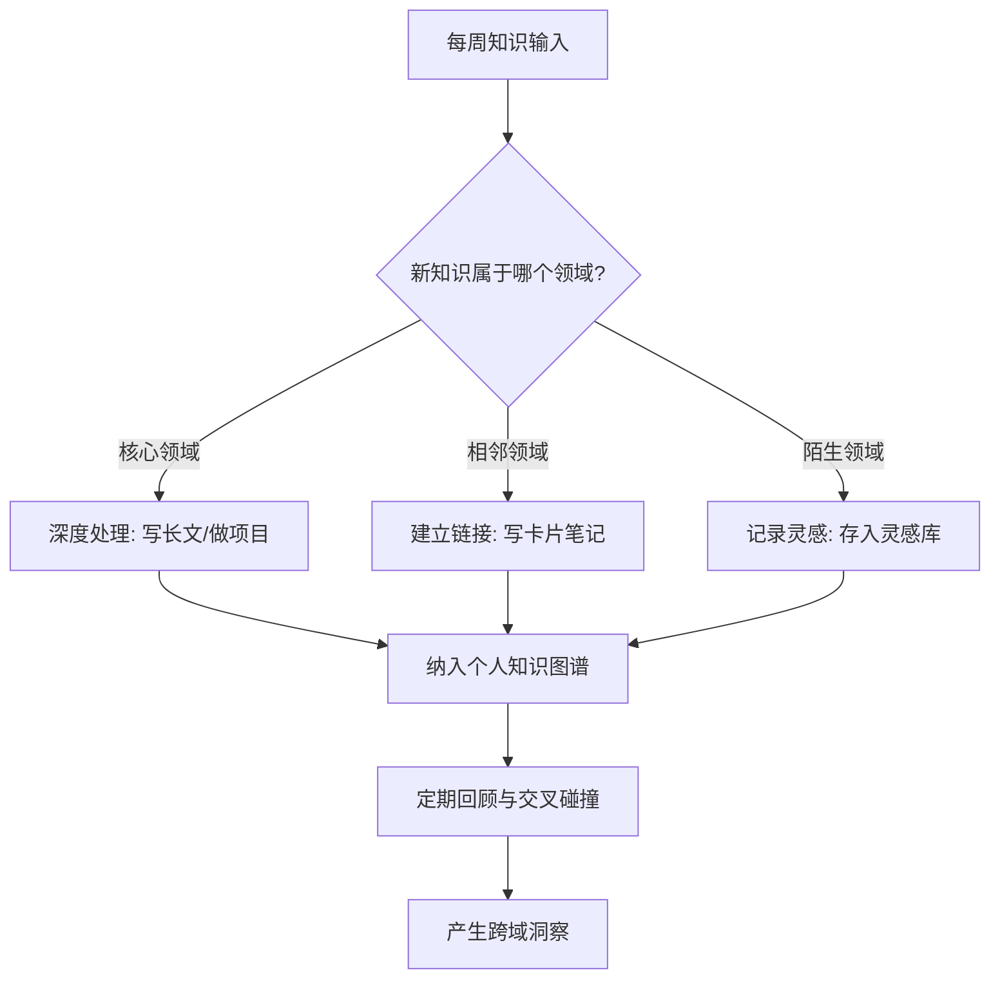
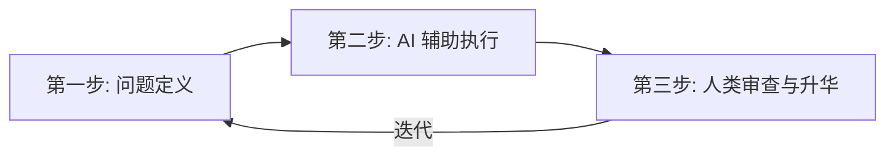
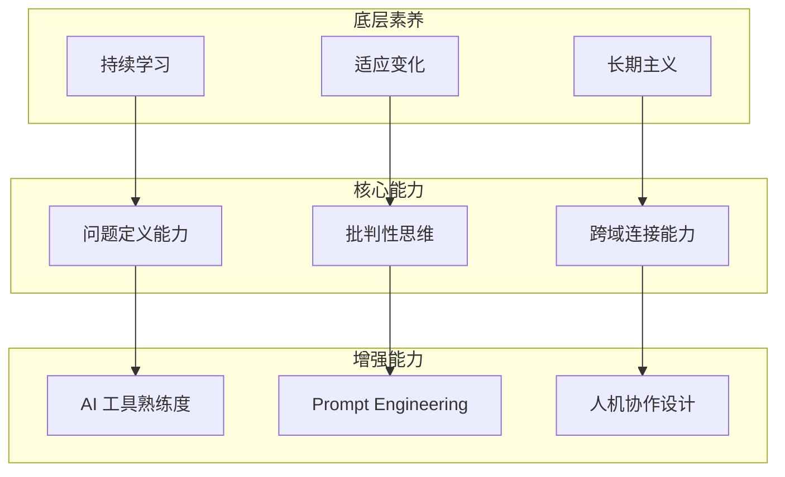

## 引言

在 AI 工具日益普及的今天，知识工作者面临着前所未有的挑战。当 ChatGPT 可以在几秒钟内生成一份报告，当 Midjourney 可以在几分钟内创作一幅插画，我们作为人类的核心竞争力究竟是什么？

这不是一个新问题，但 2025-2026 年的大模型能力跃升让它变得无比紧迫。Claude、GPT-4o、Gemini 等工具已经能完成过去需要数天才能交付的工作。面对这种冲击，焦虑是正常的，但焦虑之后需要的是**系统性思考**和**可执行的策略**。

本文将从三个核心维度出发，结合具体案例和可操作的方法论，探讨 AI 时代知识工作者的生存之道。

## 核心观点

### 1. 从"知识储备"转向"知识连接"

AI 擅长的是已有知识的检索和重组。给它一个明确的问题，它能在数秒内从海量数据中提取、整合、生成结构化的回答。但 AI 的局限在于：它只能在已有知识的边界内操作，无法真正实现"跨域洞察"——那种将生物学中的进化论与产品设计中的迭代思维碰撞出新火花的跳跃性思考。

**具体案例：** 一位产品经理在设计用户增长策略时，如果只依赖 AI 搜索"增长黑客方法论"，得到的不过是已有策略的重新排列组合。但如果他同时具备行为经济学的知识背景，就能将"损失厌恶"心理机制融入增长策略设计——比如将免费试用改为"限时体验"，利用用户对"失去"的恐惧感提升转化率。这种跨域连接是 AI 目前难以自主完成的。

**方法论：T 型知识结构**

在 AI 时代，知识的广度比深度更有价值。建议采用 T 型知识结构：

- **横向（广度）：** 每季度至少深入了解一个与你主业无关的领域。不需要成为专家，但需要理解其核心思维模型。推荐阅读《穷查理宝典》中的"多元思维模型"章节。
- **纵向（深度）：** 在你的核心领域保持 2-3 个 AI 难以替代的专精技能，比如复杂系统架构设计、高难度谈判、创造性问题定义。

**可操作建议：**

1. **建立"知识碰撞日记"**：每周花 30 分钟，随机从你的笔记库中抽取两个不相关的主题，强制思考它们之间的联系。
2. **使用双向链接工具**：如 [Obsidian](/blog/notion-obsidian-dual-track) 或 Logseq，让知识之间的隐性关联自然浮现。
3. **参加跨领域社群**：不要只混迹于本行业的圈子，定期参加其他领域的分享会或线上社区。

### 2. 从"效率至上"转向"价值导向"

不是所有事情都需要更快地完成。有些事情值得花更多时间，因为它们承载着人类独有的思考深度。AI 让"快"变得廉价，因此"慢"反而成了稀缺品。

**具体案例：** 一份用 AI 在 5 分钟内生成的市场分析报告，和一位分析师花一周时间、经过深度访谈和数据交叉验证后产出的报告，在"信息量"上可能差距不大，但在"洞察质量"和"可信度"上却有天壤之别。前者适合快速了解概况，后者适合做关键决策。问题在于：你是否清楚自己当前需要的是哪种？

**方法论：任务价值矩阵**

将你的工作按照"AI 可替代性"和"价值影响度"两个维度进行分类：

| 象限              | 特征                   | 策略                     | 示例                             |
| ----------------- | ---------------------- | ------------------------ | -------------------------------- |
| 高价值 / 低可替代 | 需要人类判断力和创造力 | 投入更多时间，深度打磨   | 战略规划、关键决策、创意构思     |
| 高价值 / 高可替代 | AI 能辅助但需人类把关  | 用 AI 加速，人类审核     | 数据分析初稿、代码生成、文案初稿 |
| 低价值 / 低可替代 | 繁琐但 AI 暂时做不好   | 寻找自动化方案，逐步替代 | 格式转换、数据清洗               |
| 低价值 / 高可替代 | AI 已能很好完成        | 立即交给 AI              | 会议纪要、邮件回复、信息检索     |

**可操作建议：**

1. **每周做一次"时间审计"**：记录你每天的时间花在哪里，标记哪些任务可以交给 AI，哪些必须亲自做。
2. **为高价值任务设立"深度工作时段"**：每天至少保留 2 小时不被打扰的时间，用于需要深度思考的工作。参考 Cal Newport 的《深度工作》。
3. **建立"AI 优先"原则**：接到任何新任务时，先问自己"AI 能完成 80% 吗？"如果可以，让 AI 做初稿，你做最后的 20% 精修。

### 3. 从"个人英雄"转向"人机协作"

最好的知识工作者不是那些拒绝 AI 的人，也不是那些完全依赖 AI 的人，而是那些善于将人类判断力与 AI 能力结合的人。这种人我们称之为"AI 增强型知识工作者"。

**具体案例：** 软件开发领域已经给出了最好的示范。GitHub Copilot 发布后，并没有取代程序员，反而让优秀程序员的生产力提升了 40-55%。关键在于：程序员负责架构设计、需求理解和代码审查，AI 负责代码生成、Bug 修复建议和文档编写。人类做"决策层"，AI 做"执行层"。

**方法论：人机协作三步法**

**第一步：问题定义（人类主导）**

这是最关键也最容易被忽视的一步。AI 的输出质量直接取决于你提出问题的质量。

- **坏问题：** "帮我写一篇关于 AI 的文章"
- **好问题：** "我需要一篇 2000 字的文章，面向有 3-5 年工作经验的产品经理，主题是'如何在产品设计中融入 AI 能力'，需要包含 3 个真实案例和可操作的实施框架"

工具推荐：使用 **Prompt 模板库** 来标准化你的提问方式。可以在 Notion 或 Obsidian 中建立自己的 Prompt 模板库，按场景分类存储。

**第二步：AI 辅助执行（AI 主导）**

将定义好的任务交给 AI，让它快速产出初稿。关键技巧：

- **分步指令**：不要一次性给出所有要求，而是分步骤引导 AI 完成。
- **提供上下文**：给 AI 足够的背景信息，包括目标受众、已有材料、期望风格等。
- **多轮对话**：把 AI 当作一个聪明的实习生，通过多轮对话逐步优化输出。

**第三步：人类审查与升华（人类主导）**

这是体现你核心价值的环节。审查 AI 输出时，关注以下几点：

1. **事实准确性**：AI 会"幻觉"，必须验证关键数据和引用。
2. **逻辑一致性**：检查论证链条是否完整，是否存在自相矛盾。
3. **价值增量**：AI 的输出是否真正解决了问题？是否缺少了关键视角？
4. **个性化润色**：加入你的独特见解、经验和风格，让输出从"正确"变成"出色"。

**工具推荐：**

| 工具                    | 用途               | 推荐理由                       |
| ----------------------- | ------------------ | ------------------------------ |
| Claude / GPT-4o         | 通用文本生成与推理 | 长文本理解能力强，适合复杂任务 |
| Perplexity              | 实时信息检索与整合 | 自动附带来源引用，减少幻觉     |
| GitHub Copilot / Cursor | 代码生成与辅助编程 | 深度集成开发环境，效率提升显著 |
| Midjourney / DALL-E     | 图像生成与设计辅助 | 快速产出视觉原型，降低设计门槛 |
| Notion AI               | 文档协作与知识管理 | 与现有工作流无缝集成           |

## 知识工作者的新能力模型

综合以上三个维度，AI 时代知识工作者需要构建新的能力模型：

## 结论

AI 时代不是知识工作者的终结，而是重新定义价值的开始。那些能够建立独特知识连接、坚持价值导向、善用人机协作的知识工作者，不仅不会被淘汰，反而会迎来前所未有的机遇。

> "在 AI 时代，最稀缺的不是信息，而是判断力；不是速度，而是方向感；不是效率，而是意义感。"

坚持人类本体价值，拥抱长期主义。与其担心被 AI 取代，不如花时间思考：**什么事情是只有你能做到的？** 把更多时间投入到这些事情上，让 AI 帮你处理其余的一切。

---

_相关阅读：[Notion + Obsidian 双轨知识管理系统](/blog/notion-obsidian-dual-track) —— 构建你的个人知识管理基础设施_
