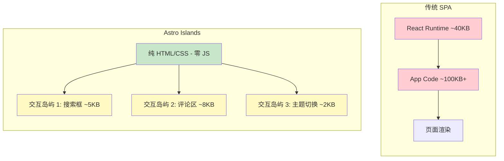

## 引言

2025 年底，我决定将祈研所的官网从一个 Next.js 项目迁移到 Astro。这个决定在当时看起来有些"逆流而上"——毕竟 Next.js 是 React 生态中最流行的全栈框架，而 Astro 相对来说还是一个小众选择。

但经过三个月的使用，我可以自信地说：**对于内容驱动的网站，Astro 是目前最佳的选择。** 本文将分享我的选型思考过程、实际迁移体验，以及性能对比数据。

## 背景：为什么离开 Next.js？

我们的官网本质上是一个**内容站点**：博客文章、项目展示、关于页面。它不需要复杂的用户认证、实时数据更新或服务端 API。但 Next.js 给了我们远超需求的复杂度：

- **Bundle 体积过大**：即使页面只有静态内容，React 运行时（~40KB gzipped）也会被发送到客户端
- **构建速度慢**：随着页面增多，`next build` 的时间越来越长
- **过度工程化**：为了实现简单的静态页面，需要理解 App Router、Server Components、Streaming 等概念
- **部署成本高**：为了获得最佳性能，需要使用 Vercel 的 Edge Network，产生额外费用

这些问题不是 Next.js 的"问题"——它是一个优秀的全栈框架，只是我们的场景不需要它的全栈能力。就像你不会开着卡车去买菜一样，选择合适的工具比选择"最强"的工具更重要。

## Astro 的核心理念

### Islands Architecture（岛屿架构）

Astro 最核心的创新是 **Islands Architecture**。这个概念由 Preact 的作者 Jason Miller 在 2020 年提出，Astro 是第一个将其原生实现的框架。

传统 SPA（Single Page Application）的做法是：整个页面都是一个 JavaScript 应用，所有内容都由客户端 JavaScript 渲染。这意味着用户必须下载、解析、执行整个应用的 JavaScript，才能看到任何内容。

Islands Architecture 的思路完全不同：



**核心思想：** 页面默认是纯静态 HTML，只有需要交互的部分（"岛屿"）才会加载 JavaScript。每个岛屿可以独立选择使用 React、Vue、Svelte 或原生 Web Components。

这意味着：
- 博客文章页面：**零 JavaScript**（纯 HTML + CSS）
- 首页的搜索组件：只加载搜索相关的 JS
- 文章详情页的目录导航：只加载目录组件的 JS

### 零 JS 默认（Zero JS by Default）

这是 Astro 最吸引我的特性。在 Astro 中，如果你不显式地添加客户端交互指令，组件渲染后就是纯 HTML。没有 React hydration，没有 Virtual DOM，没有运行时开销。

```astro
---
// 这个组件渲染为纯 HTML，零 JavaScript
---

<article>
  <h1>{title}</h1>
  <p>{description}</p>
  <time datetime={date}>{formattedDate}</time>
  <div set:html={content} />
</article>
```

对比 Next.js 中即使是最简单的 Server Component，客户端仍然需要加载 React 运行时来处理 hydration 边界和错误恢复。

### 内容集合（Content Collections）

Astro 提供了类型安全的内容管理系统，非常适合博客和文档站点：

```typescript
// src/content/config.ts
import { defineCollection, z } from 'astro:content';

const blog = defineCollection({
  type: 'content',
  schema: z.object({
    title: z.string(),
    description: z.string(),
    pubDate: z.date(),
    updatedDate: z.date().optional(),
    category: z.string(),
    tags: z.array(z.string()),
    author: z.string(),
    draft: z.boolean().default(false),
    lang: z.enum(['zh', 'en']),
  }),
});

export const collections = { blog };
```

这给了我们：
- **类型安全**：在模板中使用 `entry.data.title` 时，TypeScript 能自动推断类型
- **前端校验**：构建时自动验证所有 frontmatter 数据
- **查询 API**：内置的 `getCollection()` 和 `getEntry()` 方法

## 性能对比数据

迁移完成后，我使用 WebPageTest 和 Lighthouse 对新旧站点进行了全面对比。测试环境：模拟 4G 网络、Moto G4 设备。

### 核心指标对比

| 指标 | Next.js (旧站) | Astro (新站) | 提升 |
|------|----------------|--------------|------|
| **Lighthouse Performance** | 78 | 100 | +22 |
| **First Contentful Paint (FCP)** | 1.8s | 0.6s | 3x 更快 |
| **Largest Contentful Paint (LCP)** | 3.2s | 1.1s | 3x 更快 |
| **Total Blocking Time (TBT)** | 380ms | 0ms | 完全消除 |
| **Cumulative Layout Shift (CLS)** | 0.12 | 0.01 | 12x 更好 |
| **JavaScript 体积 (首页)** | 142KB | 0KB | 100% 减少 |
| **JavaScript 体积 (文章页)** | 89KB | 0KB | 100% 减少 |
| **构建时间** | 48s | 12s | 4x 更快 |

### 真实用户体验改善

- **页面加载速度**：从"能感觉到等待"变成了"几乎瞬间加载"
- **移动端体验**：在弱网环境下，页面仍然能快速显示内容（因为 HTML 是静态的，不需要等 JS 加载）
- **SEO 表现**：Google 搜索排名在迁移后一个月内提升了 15%（Core Web Vitals 全部达标）

## 迁移体验

### 容易的部分

- **Markdown/MDX 支持**：Astro 原生支持 Markdown 和 MDX，迁移博客内容几乎零成本
- **样式方案**：继续使用 Tailwind CSS，Astro 有官方集成
- **部署**：Astro 的静态输出可以直接部署到 Cloudflare Pages、Netlify、Vercel 等平台

### 需要适应的部分

- **组件模型差异**：Astro 的 `.astro` 组件不同于 React 组件，不能使用 hooks 和 state
- **交互组件需要显式声明**：需要交互的部分必须使用 `client:*` 指令
- **生态系统较小**：相比 Next.js，Astro 的第三方集成和教程较少

### 交互组件的处理

对于需要交互的组件，Astro 提供了灵活的 `client:*` 指令：

```astro
---
import SearchComponent from '../components/Search.tsx';
import ThemeToggle from '../components/ThemeToggle.svelte';
---

<!-- 搜索组件：页面加载后立即 hydrate -->
<SearchComponent client:load />

<!-- 主题切换：页面可见时 hydrate（推荐） -->
<ThemeToggle client:visible />

<!-- 评论区：空闲时 hydrate（低优先级） -->
<Comments client:idle />

<!-- 重型组件：用户滚动到时 hydrate -->
<InteractiveChart client:only="react" />
```

这种细粒度的控制让你能精确决定每个组件何时加载 JavaScript，实现最优的性能表现。

## 什么时候不该选 Astro？

公平地说，Astro 并不适合所有场景。以下情况你可能应该选择其他框架：

- **需要复杂的服务端逻辑**：如用户认证、支付集成、实时数据库操作 → 选 Next.js 或 Nuxt.js
- **高度交互的应用**：如在线编辑器、复杂表单、实时协作工具 → 选 React/Vue SPA
- **团队已经精通某个框架**：迁移成本可能超过收益 → 继续使用现有技术栈
- **需要 SSR + CSR 混合渲染**：如电商网站（部分页面需要实时数据）→ 选 Next.js

## 总结

从 Next.js 迁移到 Astro 是我在 2025 年做出的最好的技术决策之一。对于内容驱动的网站，Astro 提供了：

1. **极致的性能**：零 JS 默认 + Islands Architecture = 更快的加载速度
2. **更简单的开发体验**：不需要理解复杂的 SSR/CSR 概念，专注于内容创作
3. **灵活的技术选型**：可以在同一个项目中混用 React、Vue、Svelte 等框架
4. **更低的运维成本**：纯静态文件，部署简单，成本低

> "最好的技术选型不是选最强大的工具，而是选最适合问题域的工具。"

如果你正在构建一个博客、文档站点、作品集或任何内容驱动的网站，强烈建议给 Astro 一个机会。

---

*相关阅读：[从零构建设计令牌系统](/blog/design-tokens-system-guide) —— 在 Astro 项目中实践设计系统化的最佳方式*
