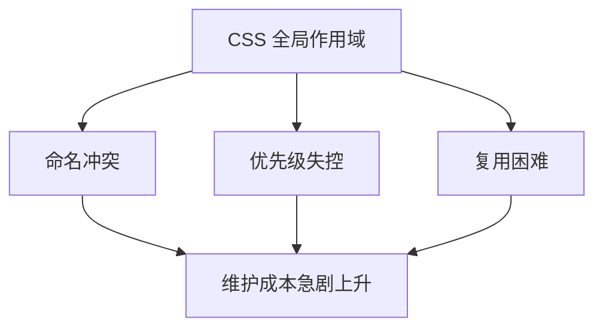
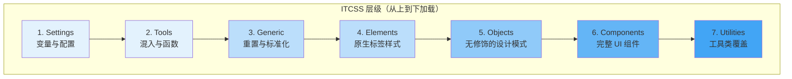
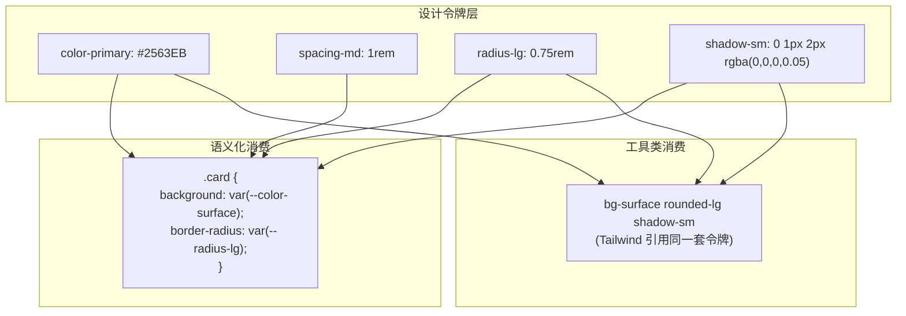
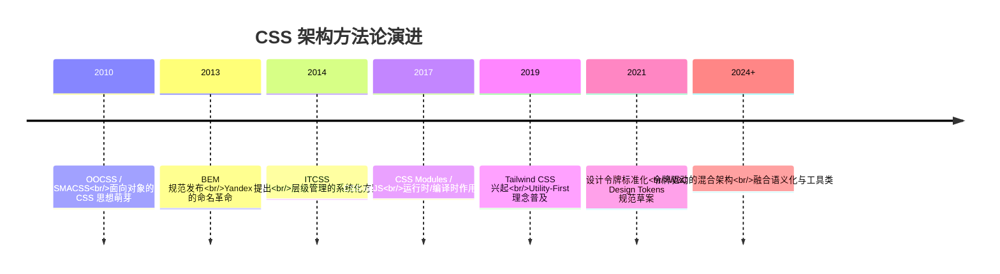

## 引言

每一个前端开发者都经历过这样的噩梦：打开一个两年前的项目，发现 `main.css` 已经膨胀到 8000 多行，修改一个按钮的颜色需要小心翼翼地排查 20 多个选择器的优先级冲突，而 `!important` 像杂草一样遍布代码库。

CSS 看似简单，但在项目规模增长后，它的"全局污染"和"优先级混乱"两大顽疾会急剧放大维护成本。过去十年间，前端社区发展出了多种 CSS 架构方法论来应对这些挑战。本文将梳理从 BEM 到设计令牌的演进脉络，帮助你在中大型项目中找到合适的 CSS 组织策略。

## CSS 架构的核心挑战

在深入方法论之前，先明确 CSS 架构需要解决的三个核心问题：

1. **命名冲突**：全局作用域下，不同模块的同名类选择器会互相覆盖
2. **优先级失控**：嵌套选择器层层叠加，后期只能靠 `!important` 强行覆盖
3. **复用困难**：样式与组件强耦合，跨项目复用几乎不可能



理解了这三个痛点，就能更好地理解每一种方法论试图解决的问题。

## BEM：命名规范的基石

### 核心理念

BEM（Block Element Modifier）由 Yandex 团队提出，是最经典的 CSS 命名规范。它通过严格的命名约定来解决命名冲突和优先级问题。

- **Block（块）**：独立的 UI 功能单元，如 `card`、`menu`、`button`
- **Element（元素）**：块的组成部分，用双下划线连接，如 `card__title`、`menu__item`
- **Modifier（修饰符）**：块或元素的外观变体，用双连字符连接，如 `card--featured`、`button--primary`

### 实践示例

```html
<!-- BEM 命名的 HTML 结构 -->
<div class="card card--featured">
  
  <div class="card__body">
    <h3 class="card__title">文章标题</h3>
    <p class="card__description card__description--truncated">
      文章摘要内容...
    </p>
    <div class="card__actions">
      <button class="card__btn card__btn--primary">阅读全文</button>
    </div>
  </div>
</div>
```

```css
/* BEM 风格的 CSS */
.card {
  background: var(--color-surface);
  border: 1px solid var(--color-border);
  border-radius: var(--radius-lg);
  overflow: hidden;
}

.card--featured {
  border-color: var(--color-primary);
  box-shadow: var(--shadow-md);
}

.card__title {
  font-size: var(--font-size-xl);
  font-weight: var(--font-weight-bold);
  color: var(--color-text);
  margin: 0 0 var(--spacing-2);
}

.card__description--truncated {
  display: -webkit-box;
  -webkit-line-clamp: 3;
  -webkit-box-orient: vertical;
  overflow: hidden;
}
```

### BEM 的优势与局限

| 优势 | 局限 |
|------|------|
| 命名自解释，降低沟通成本 | 类名较长，HTML 冗余 |
| 天然扁平化选择器，避免优先级问题 | 对复杂嵌套组件的表达力有限 |
| 团队协作友好，命名规则明确 | 缺乏对主题切换的原生支持 |
| 与预处理器（Sass/Less）配合良好 | 不解决跨项目样式复用问题 |

> **实践建议**：BEM 的核心价值在于"扁平化选择器"。即使你不严格遵循 BEM 的命名格式，也应坚持"类名一层深"的原则，避免 `.card .body .title` 这种嵌套选择器。

## ITCSS：层级管理的智慧

### 核心理念

ITCSS（Inverted Triangle CSS）由 Harry Roberts 提出，解决的是 CSS 文件的组织顺序问题。它将样式按照"特异性从低到高"的顺序排列，形成一个倒三角形结构。



### 各层详解

```scss
// 1. Settings —— 设计变量（不输出 CSS）
$color-primary: #2563EB;
$color-text: #111827;
$spacing-base: 1rem;

// 2. Tools —— Sass 混入和函数（不输出 CSS）
@mixin respond-to($breakpoint) {
  @if $breakpoint == "md" {
    @media (min-width: 768px) { @content; }
  }
}

// 3. Generic —— 重置和标准化
@import "normalize";
*, *::before, *::after { box-sizing: border-box; }

// 4. Elements —— 原生 HTML 标签样式
h1, h2, h3 { line-height: 1.25; }
a { color: $color-primary; text-decoration: none; }
img { max-width: 100%; display: block; }

// 5. Objects —— 无视觉修饰的设计模式（如网格、容器）
.grid { display: grid; gap: $spacing-base; }
.container { max-width: 1200px; margin: 0 auto; padding: 0 $spacing-base; }

// 6. Components —— 完整的 UI 组件
.card { /* ... */ }
.button { /* ... */ }
.nav { /* ... */ }

// 7. Utilities —— 高优先级的工具类
.u-hidden { display: none !important; }
.u-text-center { text-align: center !important; }
.u-mt-4 { margin-top: $spacing-base !important; }
```

### ITCSS 的价值

ITCSS 的核心洞察是：**样式的加载顺序决定了特异性冲突的胜负**。通过将低特异性的样式放在前面、高特异性的放在后面，你可以在不使用 `!important` 的情况下实现可预测的覆盖行为。

> **实践建议**：ITCSS 不需要严格照搬全部七层。对于中小型项目，简化为"变量 → 重置 → 组件 → 工具类"四层即可。关键原则是：**特异性低的在前，特异性高的在后**。

## Utility-First：效率的极致追求

### 核心理念

Utility-First（以 Tailwind CSS 为代表）彻底改变了 CSS 的编写方式：不再为每个组件编写自定义样式，而是通过组合原子化的工具类来构建界面。

```html
<!-- 传统方式：自定义 CSS 类 -->
<div class="card">
  <h2 class="card__title">标题</h2>
  <p class="card__text">内容</p>
</div>

<!-- Utility-First 方式 -->
<div class="bg-white border border-gray-200 rounded-lg p-6 shadow-sm hover:shadow-md transition-shadow">
  <h2 class="text-xl font-bold text-gray-900 mb-2">标题</h2>
  <p class="text-gray-600 text-sm leading-relaxed">内容</p>
</div>
```

### Utility-First vs 语义化 CSS

这是近年来前端社区争论最激烈的话题之一。让我们客观地对比：

| 维度 | Utility-First | 语义化 CSS（BEM 等） |
|------|---------------|---------------------|
| **开发速度** | 快，无需切换文件 | 较慢，需要编写和引用 CSS |
| **HTML 可读性** | 类名冗长，结构不直观 | 类名语义清晰，结构一目了然 |
| **设计一致性** | 天然一致（共用同一套工具类） | 需要自觉遵守设计规范 |
| **学习曲线** | 需要记忆大量工具类名 | 命名规范简单直观 |
| **CSS 体积** | 构建后按需裁剪，体积可控 | 取决于编写质量，容易冗余 |
| **重构成本** | 低，直接修改 HTML 类名 | 高，可能需要同步修改 CSS |
| **设计系统适配** | 通过配置文件统一管理 | 通过变量和混入统一管理 |
| **团队协作** | 设计稿还原度高 | 需要设计与开发对齐命名 |

### Utility-First 的隐忧

Utility-First 并非银弹。在实际项目中，它有几个需要注意的问题：

1. **HTML 膨胀**：一个复杂组件可能需要十几个类名，HTML 变得冗长
2. **抽象泄漏**：样式细节暴露在 HTML 中，违反了关注点分离原则
3. **响应式复杂度**：大量 `sm:`、`md:`、`lg:` 前缀让 HTML 更难阅读

```html
<!-- 过度使用工具类的例子 -->
<div class="flex items-center justify-between px-4 sm:px-6 lg:px-8 py-3 sm:py-4
            bg-white dark:bg-gray-900 border-b border-gray-200 dark:border-gray-700
            sticky top-0 z-50 backdrop-blur-sm bg-white/80 dark:bg-gray-900/80">
  <!-- 这段 HTML 很难快速理解其语义 -->
</div>
```

## 设计令牌：统一两者的桥梁

### 从对立到融合

Utility-First 和语义化 CSS 的争论，本质上是"效率"与"可维护性"的权衡。而**设计令牌**（Design Tokens）提供了一种融合两者的思路：用设计令牌定义语义化的设计决策，用工具类或组件类消费这些令牌。



### 实际项目中的融合策略

在 Tailwind 中使用设计令牌：

```javascript
// tailwind.config.js —— 将设计令牌映射到 Tailwind
export default {
  theme: {
    extend: {
      colors: {
        // 别名令牌（语义化）
        primary: 'var(--color-primary)',
        'primary-hover': 'var(--color-primary-hover)',
        surface: 'var(--color-surface)',
        background: 'var(--color-background)',
        text: {
          DEFAULT: 'var(--color-text)',
          muted: 'var(--color-text-muted)',
        },
        border: 'var(--color-border)',
      },
      spacing: {
        // 使用设计令牌定义间距
        '4': 'var(--spacing-4)',
        '6': 'var(--spacing-6)',
        '8': 'var(--spacing-8)',
      },
      borderRadius: {
        'md': 'var(--radius-md)',
        'lg': 'var(--radius-lg)',
      },
    },
  },
}
```

这样，无论是使用语义化的组件类还是工具类，底层都引用同一套设计令牌。修改主题时，只需要更新令牌值，所有消费方自动生效。

> **延伸阅读**：关于设计令牌的完整构建方法，请参阅 [从零构建设计令牌系统](/blog/design-tokens-system-guide)。

## 实际项目中的 CSS 组织策略

基于以上方法论，我推荐一种适合中大型项目的分层 CSS 架构：

```mermaid
graph TD
    subgraph "第 1 层：设计令牌
        A[令牌定义 JSON/YAML]
    end
    subgraph "第 2 层：基础样式
        B[CSS Reset]
        C[原生标签样式]
        D[排版系统]
    end
    subgraph "第 3 层：设计模式
        E[布局模式]
        F[间距模式]
    end
    subgraph "第 4 层：组件样式
        G[业务组件]
        H[通用组件]
    end
    subgraph "第 5 层：工具类
        I[间距/排版工具类]
        J[响应式工具类]
        K[状态工具类]
    end

    A --> B
    B --> C --> D --> E --> F --> G --> H --> I --> J --> K
```

### 文件组织结构

```
src/styles/
├── tokens/              # 设计令牌
│   ├── colors.json
│   ├── typography.json
│   └── spacing.json
├── foundations/          # 基础样式
│   ├── reset.css
│   ├── elements.css
│   └── typography.css
├── patterns/            # 设计模式
│   ├── grid.css
│   └── container.css
├── components/          # 组件样式
│   ├── card.css
│   ├── button.css
│   └── nav.css
└── utilities/           # 工具类
    ├── spacing.css
    └── responsive.css
```

### 核心原则

1. **令牌驱动**：所有设计值通过令牌管理，组件和工具类消费令牌而非硬编码值
2. **组件优先**：高频复用的 UI 模式封装为组件类，低频的一次性布局使用工具类
3. **单向依赖**：上层可以引用下层，下层不能引用上层。组件可以引用令牌和基础样式，但不能引用工具类
4. **渐进增强**：新项目可以从 Utility-First 起步，随着组件库成熟逐步提取为语义化组件类

## 方法论演进总结

| 方法论 | 解决的核心问题 | 适用场景 | 局限性 |
|--------|---------------|----------|--------|
| **BEM** | 命名冲突与优先级 | 需要语义化类名的项目 | 类名冗长，缺乏主题支持 |
| **ITCSS** | 样式加载顺序与组织 | 中大型项目的文件组织 | 层级划分较重，学习成本高 |
| **Utility-First** | 开发效率与设计一致性 | 快速迭代的项目 | HTML 膨胀，抽象泄漏 |
| **设计令牌** | 设计决策的统一管理 | 需要多主题/跨平台的项目 | 需要工具链支持 |



## 总结

CSS 架构没有银弹。BEM 解决了命名问题，ITCSS 解决了组织问题，Utility-First 解决了效率问题，设计令牌解决了一致性问题。在实际项目中，最好的策略往往是**融合多种方法论的优点**：用设计令牌统一设计决策，用 BEM 命名核心组件，用工具类处理一次性布局，用 ITCSS 的思路组织文件加载顺序。

选择哪种方法论，取决于你的项目规模、团队偏好和迭代节奏。但无论选择哪种，**建立一套统一的 CSS 架构规范并坚持执行**，远比纠结于哪种方法论"最好"更重要。

> "好的 CSS 架构不是选择某一种方法论，而是理解每种方法论的取舍，在项目语境中做出合理的组合。"

---

*相关阅读：[从零构建设计令牌系统](/blog/design-tokens-system-guide) —— 设计令牌的完整构建指南*
