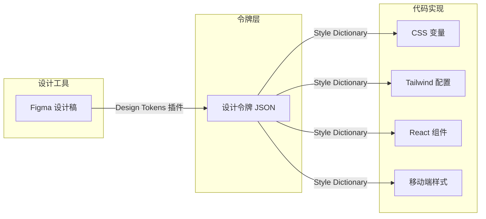
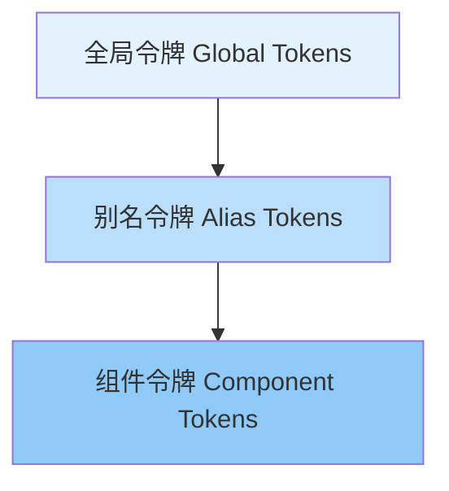

## 引言

你有没有遇到过这样的场景：设计师在 Figma 中定义了一套颜色规范，但开发者在代码中使用了完全不同的色值？产品改版时，设计师更新了主色调，但开发者需要逐个文件查找替换？暗色模式下，某些组件的颜色看起来"不太对"，但没人能准确定位问题出在哪里？

这些问题的根源是同一个：**缺乏一套统一、可维护的设计决策层。** 设计令牌（Design Tokens）正是解决这个问题的方案。

## 什么是设计令牌？

设计令牌是设计系统中**最原子级别的决策单元**。它们是设计属性（颜色、字体、间距、圆角、阴影等）的抽象表示，以键值对的形式存储，可以在不同平台和工具之间共享。

一个简单的设计令牌长这样：

```json
{
  "color": {
    "primary": {
      "value": "#2563EB",
      "type": "color",
      "description": "品牌主色，用于主要按钮、链接和关键交互元素"
    }
  }
}
```

关键在于：**令牌存储的是"决策"而不是"实现"。** `color.primary` 是一个设计决策（"我们需要一个主色"），而 `#2563EB` 是这个决策在特定上下文中的实现。当品牌升级时，你只需要修改令牌的值，所有引用这个令牌的地方都会自动更新。



## 为什么需要设计令牌？

### 1. 设计与开发的一致性

当设计师和开发者使用同一套令牌时，"设计走样"的问题就从根本上解决了。设计师在 Figma 中使用 `color.primary`，开发者在代码中引用 `--color-primary`，两者指向同一个值。

### 2. 多主题支持

设计令牌让主题切换变得简单。你只需要准备多套令牌值，运行时切换即可：

```css
/* 亮色主题 */
:root {
  --color-bg: #ffffff;
  --color-text: #1a1a2e;
  --color-primary: #2563eb;
}

/* 暗色主题 */
[data-theme='dark'] {
  --color-bg: #0f172a;
  --color-text: #e2e8f0;
  --color-primary: #60a5fa;
}
```

### 3. 跨平台一致性

同一套设计令牌可以生成 Web、iOS、Android 各平台的代码，确保品牌在所有触点上保持一致。

### 4. 可维护性和可扩展性

修改一个令牌值，所有引用处自动生效。新增一个主题，只需要新增一组令牌值，不需要修改任何组件代码。

## 令牌的分层架构

成熟的设计令牌系统通常分为三层：



### 第一层：全局令牌（Global Tokens）

这是最底层的设计值，直接对应设计系统中的原始定义。它们是"是什么"的描述。

```json
{
  "color": {
    "blue": {
      "50": { "value": "#EFF6FF" },
      "100": { "value": "#DBEAFE" },
      "200": { "value": "#BFDBFE" },
      "300": { "value": "#93C5FD" },
      "400": { "value": "#60A5FA" },
      "500": { "value": "#2563EB" },
      "600": { "value": "#1D4ED8" },
      "700": { "value": "#1E40AF" },
      "800": { "value": "#1E3A8A" },
      "900": { "value": "#172554" }
    },
    "gray": {
      "50": { "value": "#F9FAFB" },
      "100": { "value": "#F3F4F6" },
      "200": { "value": "#E5E7EB" },
      "300": { "value": "#D1D5DB" },
      "400": { "value": "#9CA3AF" },
      "500": { "value": "#6B7280" },
      "600": { "value": "#4B5563" },
      "700": { "value": "#374151" },
      "800": { "value": "#1F2937" },
      "900": { "value": "#111827" }
    }
  }
}
```

### 第二层：别名令牌（Alias Tokens）

别名令牌赋予全局令牌语义化的含义。它们回答"用在哪里"的问题。

```json
{
  "color": {
    "primary": { "value": "{color.blue.500}" },
    "primary-hover": { "value": "{color.blue.600}" },
    "secondary": { "value": "{color.gray.500}" },
    "background": { "value": "{color.gray.50}" },
    "surface": { "value": "#FFFFFF" },
    "text": { "value": "{color.gray.900}" },
    "text-muted": { "value": "{color.gray.500}" },
    "border": { "value": "{color.gray.200}" },
    "error": { "value": "#DC2626" },
    "success": { "value": "#16A34A" },
    "warning": { "value": "#D97706" }
  }
}
```

### 第三层：组件令牌（Component Tokens）

组件令牌将别名令牌绑定到具体的组件属性上。它们回答"这个组件的某个部分用什么值"。

```json
{
  "button": {
    "primary": {
      "bg": { "value": "{color.primary}" },
      "bg-hover": { "value": "{color.primary-hover}" },
      "text": { "value": "#FFFFFF" },
      "border": { "value": "{color.primary}" },
      "radius": { "value": "{spacing.radius.md}" },
      "padding-x": { "value": "{spacing.md}" },
      "padding-y": { "value": "{spacing.sm}" }
    },
    "secondary": {
      "bg": { "value": "transparent" },
      "bg-hover": { "value": "{color.gray.100}" },
      "text": { "value": "{color.primary}" },
      "border": { "value": "{color.primary}" },
      "radius": { "value": "{spacing.radius.md}" },
      "padding-x": { "value": "{spacing.md}" },
      "padding-y": { "value": "{spacing.sm}" }
    }
  }
}
```

## 实战：完整的设计令牌系统

下面是一个涵盖色彩、字体、间距、阴影的完整令牌定义，以及对应的 CSS 变量输出。

### 完整令牌定义

```json
{
  "color": {
    "primary": { "value": "#2563EB", "type": "color" },
    "primary-hover": { "value": "#1D4ED8", "type": "color" },
    "secondary": { "value": "#6B7280", "type": "color" },
    "background": { "value": "#F9FAFB", "type": "color" },
    "surface": { "value": "#FFFFFF", "type": "color" },
    "text": { "value": "#111827", "type": "color" },
    "text-muted": { "value": "#6B7280", "type": "color" },
    "border": { "value": "#E5E7EB", "type": "color" },
    "error": { "value": "#DC2626", "type": "color" },
    "success": { "value": "#16A34A", "type": "color" },
    "warning": { "value": "#D97706", "type": "color" }
  },
  "font": {
    "family": {
      "sans": { "value": "'Inter', system-ui, -apple-system, sans-serif", "type": "fontFamily" },
      "mono": { "value": "'JetBrains Mono', 'Fira Code', monospace", "type": "fontFamily" }
    },
    "size": {
      "xs": { "value": "0.75rem", "type": "dimension" },
      "sm": { "value": "0.875rem", "type": "dimension" },
      "base": { "value": "1rem", "type": "dimension" },
      "lg": { "value": "1.125rem", "type": "dimension" },
      "xl": { "value": "1.25rem", "type": "dimension" },
      "2xl": { "value": "1.5rem", "type": "dimension" },
      "3xl": { "value": "1.875rem", "type": "dimension" },
      "4xl": { "value": "2.25rem", "type": "dimension" }
    },
    "weight": {
      "normal": { "value": "400", "type": "fontWeight" },
      "medium": { "value": "500", "type": "fontWeight" },
      "semibold": { "value": "600", "type": "fontWeight" },
      "bold": { "value": "700", "type": "fontWeight" }
    },
    "line-height": {
      "tight": { "value": "1.25", "type": "dimension" },
      "normal": { "value": "1.5", "type": "dimension" },
      "relaxed": { "value": "1.75", "type": "dimension" }
    }
  },
  "spacing": {
    "0": { "value": "0", "type": "dimension" },
    "1": { "value": "0.25rem", "type": "dimension" },
    "2": { "value": "0.5rem", "type": "dimension" },
    "3": { "value": "0.75rem", "type": "dimension" },
    "4": { "value": "1rem", "type": "dimension" },
    "5": { "value": "1.25rem", "type": "dimension" },
    "6": { "value": "1.5rem", "type": "dimension" },
    "8": { "value": "2rem", "type": "dimension" },
    "10": { "value": "2.5rem", "type": "dimension" },
    "12": { "value": "3rem", "type": "dimension" },
    "16": { "value": "4rem", "type": "dimension" },
    "20": { "value": "5rem", "type": "dimension" },
    "24": { "value": "6rem", "type": "dimension" },
    "radius": {
      "sm": { "value": "0.25rem", "type": "dimension" },
      "md": { "value": "0.5rem", "type": "dimension" },
      "lg": { "value": "0.75rem", "type": "dimension" },
      "xl": { "value": "1rem", "type": "dimension" },
      "full": { "value": "9999px", "type": "dimension" }
    }
  },
  "shadow": {
    "sm": { "value": "0 1px 2px 0 rgba(0, 0, 0, 0.05)", "type": "shadow" },
    "md": {
      "value": "0 4px 6px -1px rgba(0, 0, 0, 0.1), 0 2px 4px -2px rgba(0, 0, 0, 0.1)",
      "type": "shadow"
    },
    "lg": {
      "value": "0 10px 15px -3px rgba(0, 0, 0, 0.1), 0 4px 6px -4px rgba(0, 0, 0, 0.1)",
      "type": "shadow"
    },
    "xl": {
      "value": "0 20px 25px -5px rgba(0, 0, 0, 0.1), 0 8px 10px -6px rgba(0, 0, 0, 0.1)",
      "type": "shadow"
    }
  }
}
```

### 生成 CSS 变量

使用 [Style Dictionary](https://amzn.github.io/style-dictionary/) 可以将令牌 JSON 转换为各种平台的代码。以下是对应的 CSS 变量输出：

```css
:root {
  /* Colors */
  --color-primary: #2563eb;
  --color-primary-hover: #1d4ed8;
  --color-secondary: #6b7280;
  --color-background: #f9fafb;
  --color-surface: #ffffff;
  --color-text: #111827;
  --color-text-muted: #6b7280;
  --color-border: #e5e7eb;
  --color-error: #dc2626;
  --color-success: #16a34a;
  --color-warning: #d97706;

  /* Font Family */
  --font-sans: 'Inter', system-ui, -apple-system, sans-serif;
  --font-mono: 'JetBrains Mono', 'Fira Code', monospace;

  /* Font Size */
  --font-size-xs: 0.75rem;
  --font-size-sm: 0.875rem;
  --font-size-base: 1rem;
  --font-size-lg: 1.125rem;
  --font-size-xl: 1.25rem;
  --font-size-2xl: 1.5rem;
  --font-size-3xl: 1.875rem;
  --font-size-4xl: 2.25rem;

  /* Spacing */
  --spacing-1: 0.25rem;
  --spacing-2: 0.5rem;
  --spacing-3: 0.75rem;
  --spacing-4: 1rem;
  --spacing-6: 1.5rem;
  --spacing-8: 2rem;
  --spacing-12: 3rem;
  --spacing-16: 4rem;

  /* Border Radius */
  --radius-sm: 0.25rem;
  --radius-md: 0.5rem;
  --radius-lg: 0.75rem;
  --radius-xl: 1rem;
  --radius-full: 9999px;

  /* Shadows */
  --shadow-sm: 0 1px 2px 0 rgba(0, 0, 0, 0.05);
  --shadow-md: 0 4px 6px -1px rgba(0, 0, 0, 0.1), 0 2px 4px -2px rgba(0, 0, 0, 0.1);
  --shadow-lg: 0 10px 15px -3px rgba(0, 0, 0, 0.1), 0 4px 6px -4px rgba(0, 0, 0, 0.1);
  --shadow-xl: 0 20px 25px -5px rgba(0, 0, 0, 0.1), 0 8px 10px -6px rgba(0, 0, 0, 0.1);
}
```

### 在组件中使用

```css
/* 使用令牌定义组件样式 */
.btn {
  display: inline-flex;
  align-items: center;
  justify-content: center;
  padding: var(--spacing-2) var(--spacing-4);
  font-family: var(--font-sans);
  font-size: var(--font-size-sm);
  font-weight: 600;
  line-height: 1;
  border-radius: var(--radius-md);
  border: 1px solid transparent;
  cursor: pointer;
  transition: all 150ms ease;
}

.btn-primary {
  background-color: var(--color-primary);
  color: #ffffff;
}

.btn-primary:hover {
  background-color: var(--color-primary-hover);
}

.btn-secondary {
  background-color: transparent;
  color: var(--color-primary);
  border-color: var(--color-primary);
}

.btn-secondary:hover {
  background-color: var(--color-background);
}

.card {
  background-color: var(--color-surface);
  border: 1px solid var(--color-border);
  border-radius: var(--radius-lg);
  padding: var(--spacing-6);
  box-shadow: var(--shadow-sm);
}

.card:hover {
  box-shadow: var(--shadow-md);
}
```

## 工具链推荐

| 工具                    | 用途           | 推荐理由                       |
| ----------------------- | -------------- | ------------------------------ |
| **Style Dictionary**    | 令牌转换       | Amazon 开源，支持多平台输出    |
| **Figma Tokens Studio** | 设计端令牌管理 | Figma 插件，支持 JSON 导入导出 |
| **Token Transformer**   | 令牌格式转换   | 在不同令牌格式之间转换         |
| **Diez**                | 跨平台令牌分发 | 支持 iOS/Android/Web 统一分发  |
| **Twingate**            | Tailwind 集成  | 将令牌自动同步到 Tailwind 配置 |

## 最佳实践总结

1. **从别名令牌开始**：不要直接在组件中使用全局令牌（如 `blue-500`），而是使用语义化的别名令牌（如 `color-primary`）
2. **命名要有层次**：使用 `{category}.{property}.{variant}.{state}` 的命名规范，如 `color.primary.hover`
3. **文档化每个令牌**：为每个令牌添加描述信息，说明用途和使用场景
4. **版本化管理**：将令牌文件纳入 Git 版本管理，变更走 PR 审查流程
5. **自动化验证**：在 CI 中加入令牌格式校验，防止不合规的令牌被提交
6. **渐进式引入**：不需要一次性替换所有硬编码值，从新组件开始逐步迁移

## 总结

设计令牌不是"锦上添花"的高级技巧，而是**规模化前端工程的必要基础设施**。它将设计决策从实现细节中解耦，让设计系统真正变得可维护、可扩展、可跨平台复用。

无论你的团队规模是 3 人还是 30 人，无论你的项目是一个简单的博客还是复杂的企业应用，投资建设设计令牌系统都是值得的。它不仅能减少设计与开发之间的摩擦，更能为未来的主题定制、品牌升级和多端适配打下坚实的基础。

> "设计令牌是设计系统的原子。原子虽小，但构成了整个物质世界。"

---

_相关阅读：[为什么选择 Astro 作为静态站点生成器](/blog/astro-ssg-why-i-chose) —— 在 Astro 项目中实践设计令牌系统的技术基础_
