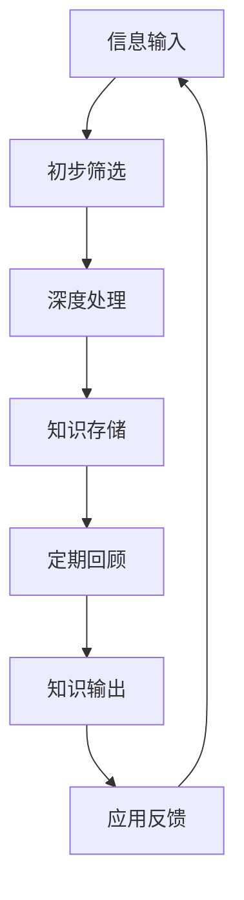

## 引言

在信息爆炸的时代，我们每天都被海量信息包围。从社交媒体的推送，到工作中的邮件和文档，再到学习时的书籍和课程，信息碎片无处不在。然而，大多数人只是被动地接收这些信息，很少有人能够将其转化为真正的知识资产。

本文将为你提供一个完整的框架，帮助你建立一个高效的个人知识管理系统（Personal Knowledge Management, PKM），让你从信息的消费者转变为知识的创造者。

## 为什么需要个人知识管理系统？

### 信息时代的三大挑战

1. **信息过载**：每天产生的信息量远超人类处理能力
2. **知识碎片化**：信息分散在不同平台，缺乏关联性
3. **记忆衰减**：根据艾宾浩斯遗忘曲线，我们会迅速忘记大部分信息

### 个人知识管理系统的价值

- **提高学习效率**：系统化学习，避免重复劳动
- **增强创造力**：通过知识关联产生新想法
- **提升决策质量**：基于结构化知识做出更明智的决策
- **建立个人品牌**：输出高质量内容，建立专业影响力

## 个人知识管理系统的核心框架

### 1. 输入层：信息获取与筛选

**原则**：不是所有信息都值得进入你的系统

**实践方法**：
- **设定信息源**：选择高质量、与目标相关的信息源
- **建立筛选标准**：问自己："这条信息对我的目标有帮助吗？"
- **使用工具**：
  - 稍后阅读：Omnivore、Raindrop
  - 信息聚合：RSS 阅读器（Feedly）
  - 笔记捕捉：Obsidian、Logseq

**筛选矩阵**：

| 信息类型 | 处理方式 | 示例 |
|---------|---------|------|
| 高价值且相关 | 深度处理 | 专业书籍、行业报告 |
| 中价值且相关 | 浅层处理 | 新闻、博客文章 |
| 低价值或不相关 | 直接忽略 | 无意义的社交媒体信息 |

### 2. 处理层：信息转化为知识

**核心任务**：将原始信息转化为结构化、可复用的知识

**处理步骤**：

1. **提炼**：用自己的话重述核心观点
2. **分类**：将知识归类到合适的主题
3. **关联**：与已有知识建立链接
4. **存储**：放入知识管理系统

**工具推荐**：
- **Obsidian**：双向链接、知识图谱
- **Notion**：结构化数据库、协作功能
- **Logseq**：大纲式笔记、日记功能

### 3. 输出层：知识应用与分享

**原则**：知识只有被应用和分享才有价值

**输出形式**：
- **个人应用**：解决问题、做出决策
- **内容创作**：写文章、做分享
- **教学分享**：辅导他人、在线课程
- **项目实践**：将知识应用到实际项目

**输出工具**：
- 写作：Markdown 编辑器
- 分享：博客平台、社交媒体
- 演讲：幻灯片工具

## 构建个人知识管理系统的步骤

### 第一阶段：基础搭建（1-2周）

1. **选择工具**：根据个人偏好选择 1-2 个核心工具
2. **建立基本结构**：创建文件夹/标签体系
3. **制定工作流**：输入 → 处理 → 输出的标准流程
4. **培养习惯**：每天花 30 分钟维护系统

### 第二阶段：内容积累（1-3个月）

1. **系统性输入**：有计划地阅读和学习
2. **持续处理**：定期整理和关联知识
3. **开始输出**：尝试写博客、做分享
4. **收集反馈**：根据反馈调整系统

### 第三阶段：系统优化（3个月以后）

1. **分析使用数据**：了解哪些知识最有价值
2. **优化结构**：根据实际使用情况调整分类
3. **自动化流程**：使用工具自动化重复任务
4. **扩展系统**：添加新的知识领域

## 个人知识管理系统的最佳实践

### 1. 原子化原则

- 每条笔记只包含一个核心观点
- 保持笔记的独立性和自包含性
- 便于日后重组和引用

### 2. 链接优先

- 主动为笔记建立双向链接
- 寻找知识之间的关联
- 构建知识网络而非孤立存储

### 3. 定期回顾

- **每日回顾**：5-10分钟浏览当日笔记
- **每周回顾**：1小时整理和关联知识
- **每月回顾**：深度思考知识体系的发展

### 4. 输出驱动

- 以输出为目标进行输入
- 通过写作和分享深化理解
- 建立个人知识品牌

## 常见误区与解决方案

### 误区 1：追求工具完美

**问题**：花费大量时间寻找和配置工具，却忽视了内容本身

**解决方案**：选择一个工具坚持使用 3 个月，再根据实际需求调整

### 误区 2：收集而不处理

**问题**：只收藏信息，不进行深度处理

**解决方案**：建立"收集 → 处理"的强制流程，设定处理期限

### 误区 3：缺乏输出

**问题**：知识只进不出，无法产生价值

**解决方案**：设定定期输出目标，如每周写一篇文章

### 误区 4：系统过于复杂

**问题**：分类体系过于繁琐，难以维护

**解决方案**：保持简单，随需调整，优先考虑实用性

## 个人知识管理系统的高级技巧

### 1. 使用 MOC（Map of Content）

创建主题索引页面，作为知识领域的导航中心：

```markdown
# 知识管理 - MOC

## 核心概念
- [[知识管理基础]]
- [[卡片盒笔记法]]
- [[个人知识图谱]]

## 工具与实践
- [[Obsidian 使用指南]]
- [[Notion 模板分享]]
- [[知识管理工作流]]

## 案例研究
- [[我的知识管理系统实践]]
- [[如何用 PKM 提升学习效率]]
```

### 2. 建立知识漏斗



### 3. 跨领域知识融合

- 主动寻找不同领域知识的共同点
- 创建跨领域的连接笔记
- 从多角度思考问题

## 结语

建立个人知识管理系统不是一蹴而就的工程，而是一个持续演进的过程。它需要你投入时间和精力，但回报是巨大的 —— 你将拥有一个随时可用的"第二大脑"，能够帮助你在信息爆炸的时代保持清晰的思维和高效的学习能力。

记住，工具只是手段，不是目的。真正重要的是你的思考方式和持续行动。开始构建你的个人知识管理系统吧，让知识成为你最宝贵的资产。

---

_相关阅读：[构建个人知识图谱：打破文件夹的线性枷锁](/blog/personal-knowledge-graph) —— 了解如何通过双向链接构建知识网络_

_相关阅读：[Notion + Obsidian 双轨知识管理系统](/blog/notion-obsidian-dual-track) —— 探索工具组合的最佳实践_
