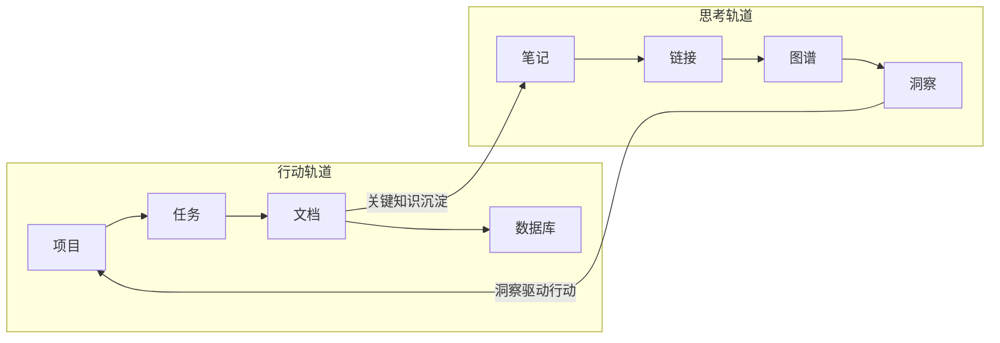
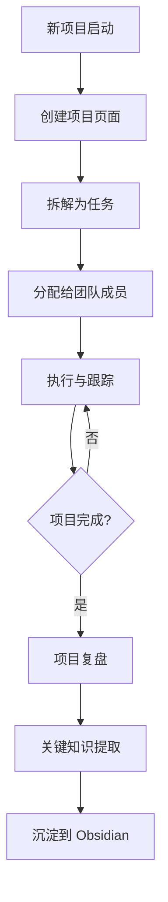

## 为什么需要双轨系统？

单一工具无法满足所有需求。Notion 擅长结构化协作，Obsidian 擅长个人知识图谱。但"两个工具"不等于"两套系统"——关键在于让它们各司其职、互为补充，而不是制造信息孤岛。

经过两年多的实践和迭代，我总结出了一套成熟的双轨知识管理方法论。这套系统的核心理念是：

- **Notion = 行动轨道**：管理"做什么"和"怎么做"
- **Obsidian = 思考轨道**：管理"为什么"和"学到了什么"



## Notion: 项目管理轨道

### 适用场景

- 任务追踪与项目管理
- 团队协作与知识共享
- 数据库与自动化工作流
- 客户关系管理（CRM）
- 会议记录与决策日志

### 模板设计

**1. 项目主模板**

每个项目在 Notion 中创建一个页面，包含以下标准结构：

```markdown
## 项目概览
- **项目名称**：
- **负责人**：
- **起止日期**：
- **状态**：🟢 进行中 / 🟡 待启动 / 🔴 已暂停 / ✅ 已完成
- **优先级**：P0 / P1 / P2

## 目标与关键结果
| OKR | 目标值 | 当前值 | 进度 |
|-----|--------|--------|------|
|     |        |        |      |

## 里程碑
- [ ] M1: xxx（截止日期）
- [ ] M2: xxx（截止日期）

## 相关资源
- 需求文档：
- 设计稿：
- 技术方案：

## 会议记录
（使用关联数据库自动汇总）

## 知识沉淀
> 从这个项目中学到了什么？→ 沉淀到 Obsidian
```

**2. 任务数据库模板**

使用 Notion Database 的 Board View 和 Timeline View：

| 字段 | 类型 | 说明 |
|------|------|------|
| 任务名称 | Title | 简洁描述 |
| 状态 | Select | 待办 / 进行中 / 审核中 / 已完成 |
| 优先级 | Select | P0 紧急 / P1 重要 / P2 一般 |
| 负责人 | Person | 指定执行人 |
| 截止日期 | Date | 包含提醒 |
| 所属项目 | Relation | 关联项目页面 |
| 预估工时 | Number | 用于排期参考 |
| 标签 | Multi-select | 分类标记 |

**3. 自动化工作流**

利用 Notion 的 Button 和 Automation 功能：

- 点击按钮自动创建"每日站会记录"页面
- 任务状态变更时自动通知相关人员
- 项目完成后自动生成"复盘问卷"

### 工作流



## Obsidian: 知识沉淀轨道

### 适用场景

- 个人笔记与深度思考
- 知识图谱与双向链接
- 长期知识积累与检索
- 读书笔记与学习总结
- 创意灵感捕捉

### 模板设计

**1. 永久笔记模板（Evergreen Note）**

```markdown
---
type: evergreen
created: {{date}}
tags: []
related: []
status: seedling
---

# {{title}}

## 核心观点


## 支撑论据


## 实际应用


## 待探索

- [ ]
```

**2. 项目复盘模板**

```markdown
---
type: review
project: ""
notion_link: ""
created: {{date}}
tags: [复盘, 项目]
---

# {{title}} - 项目复盘

## 背景与目标


## 做对了什么


## 做错了什么


## 如果重来一次


## 可复用的方法论

> [!tip] 核心收获
>

## 关联知识
- [[相关笔记1]]
- [[相关笔记2]]
```

**3. 文献笔记模板**

```markdown
---
type: literature
source: ""
author: ""
created: {{date}}
tags: [读书笔记]
---

# {{title}}

## 一句话总结


## 关键概念
1.
2.
3.

## 精选摘录
> "引用内容" — 位置

## 我的思考


## 行动项
- [ ]
```

### 核心插件推荐

| 插件 | 功能 | 为什么需要 |
|------|------|------------|
| Dataview | 数据库查询 | 用类 SQL 语法查询笔记，动态生成内容视图 |
| Templater | 高级模板 | 比 Core Templates 更灵活，支持变量和脚本 |
| Excalidraw | 手绘图表 | 在笔记中嵌入白板，可视化思考过程 |
| Kanban | 看板视图 | 在 Obsidian 中管理个人任务看板 |
| Calendar | 日历视图 | 按日期回顾每日笔记 |
| Readwise Official | 阅读同步 | 自动同步 Kindle、微信读书等平台的标注 |

## 双轨协同策略

### 同步原则

两个系统之间的信息流动需要遵循明确的规则，否则会变成"两边都要维护"的负担：

```mermaid
graph TD
    subgraph Notion 行动轨道
        N1[项目文档] --> N2[会议记录]
        N2 --> N3[决策日志]
    end
    subgraph Obsidian 思考轨道
        O1[概念笔记] --> O2[方法论]
        O2 --> O3[洞察]
    end

    N3 -- 关键决策与原因 -->|每周同步| O1
    O3 -- 成熟方法论 -->|按需同步| N1

    style N1 fill:#e8f5e9
    style N2 fill:#e8f5e9
    style N3 fill:#e8f5e9
    style O1 fill:#e3f2fd
    style O2 fill:#e3f2fd
    style O3 fill:#e3f2fd
```

**原则一：Notion 到 Obsidian —— 定期沉淀**

- **频率**：每周一次，建议安排在周五下午
- **内容**：本周的关键决策、学到的教训、有价值的方法论
- **方法**：在 Obsidian 中创建复盘笔记，附上 Notion 页面链接作为引用源

**原则二：Obsidian 到 Notion —— 按需提取**

- **触发条件**：当 Obsidian 中的某个方法论或洞察需要应用到具体项目时
- **内容**：成熟的方法论、可操作的最佳实践、经过验证的模板
- **方法**：将 Obsidian 笔记的核心内容整理后放入 Notion 的团队知识库

**原则三：避免重复**

- Notion 中不存放"思考过程"，只存放"行动结果"
- Obsidian 中不存放"待办事项"，只存放"知识沉淀"
- 如果不确定放哪里，问自己："一年后我还会回看这个内容吗？"如果是，放 Obsidian；如果只是阶段性需要，放 Notion

### 同步工具推荐

| 工具 | 方向 | 适用场景 |
|------|------|----------|
| 手动复制 + 链接 | 双向 | 最简单可靠，适合轻量使用 |
| Notion API + Obsidian 插件 | Notion → Obsidian | 自动同步指定数据库到 Obsidian |
| Zapier / Make | 双向 | 自动化触发器，适合复杂工作流 |
| MarkDownload | 网页 → Obsidian | 将网页内容保存为 Markdown 到 Obsidian |

## Notion vs Obsidian 全方位对比

| 维度 | Notion | Obsidian |
|------|--------|----------|
| **数据存储** | 云端（厂商锁定） | 本地 Markdown（数据自主） |
| **协作能力** | 强（实时多人协作） | 弱（需借助第三方同步） |
| **结构化程度** | 高（数据库、视图丰富） | 低（自由文本为主） |
| **知识图谱** | 无原生支持 | 核心功能（双向链接+图谱可视化） |
| **离线使用** | 有限支持 | 完全支持 |
| **插件生态** | 有限（集成为主） | 丰富（社区驱动，1500+ 插件） |
| **学习曲线** | 低（所见即所得） | 中高（需要理解 PKM 理念） |
| **移动端体验** | 优秀 | 良好（Obsidian Mobile） |
| **自动化** | 原生支持 | 依赖插件和脚本 |
| **适合场景** | 团队协作、项目管理、结构化数据 | 个人知识管理、深度思考、写作 |
| **数据安全** | 依赖厂商 | 完全掌控（本地+Git） |
| **长期可用性** | 依赖公司存续 | Markdown 是开放标准，永不过时 |

## 实施建议

如果你也想搭建自己的双轨系统，建议按以下步骤进行：

1. **第一周**：梳理你现有的知识管理工作流，明确哪些是"行动型"任务，哪些是"思考型"任务
2. **第二周**：在 Notion 中搭建基础的项目模板和任务数据库
3. **第三周**：在 Obsidian 中安装核心插件，创建笔记模板
4. **第四周**：建立同步机制，开始试运行
5. **第一个月后**：回顾和调整，找到最适合自己的节奏

> **重要提醒**：工具只是手段，不是目的。不要为了搭建系统而搭建系统。如果你目前用一个工具就能满足需求，完全不需要强行双轨。双轨系统的价值在于解决单一工具无法覆盖的痛点，而不是制造更多的维护负担。

## 总结

Notion + Obsidian 双轨系统的本质是**"行动"与"思考"的分离与统一**。Notion 帮你高效地"做事"，Obsidian 帮你深入地"思考"。两者通过定期沉淀和按需提取形成闭环，让你的知识管理既有广度（项目管理覆盖面）又有深度（知识沉淀质量）。

正如我们在 [AI 时代知识工作者的生存指南](/blog/ai-era-knowledge-worker) 中提到的，AI 时代最稀缺的是判断力和方向感。一个运转良好的知识管理系统，正是培养这两种能力的最佳土壤。
