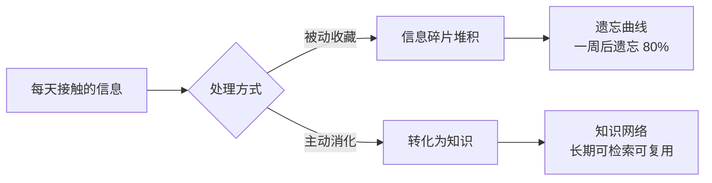
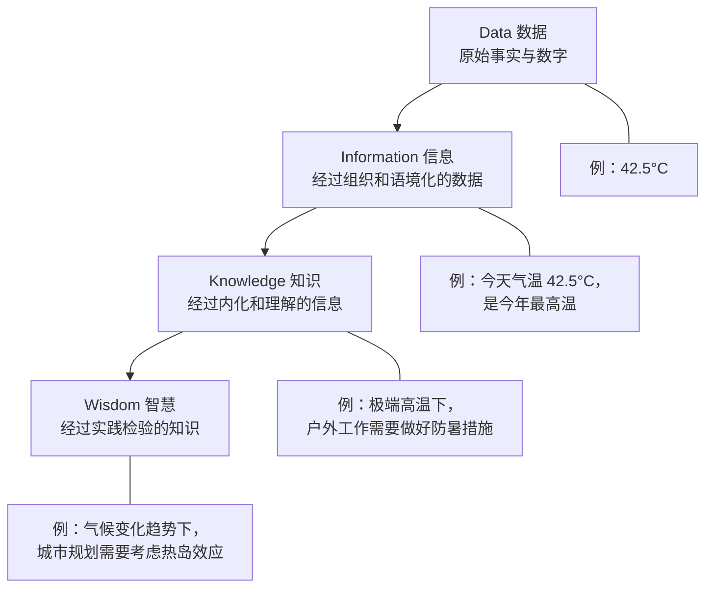
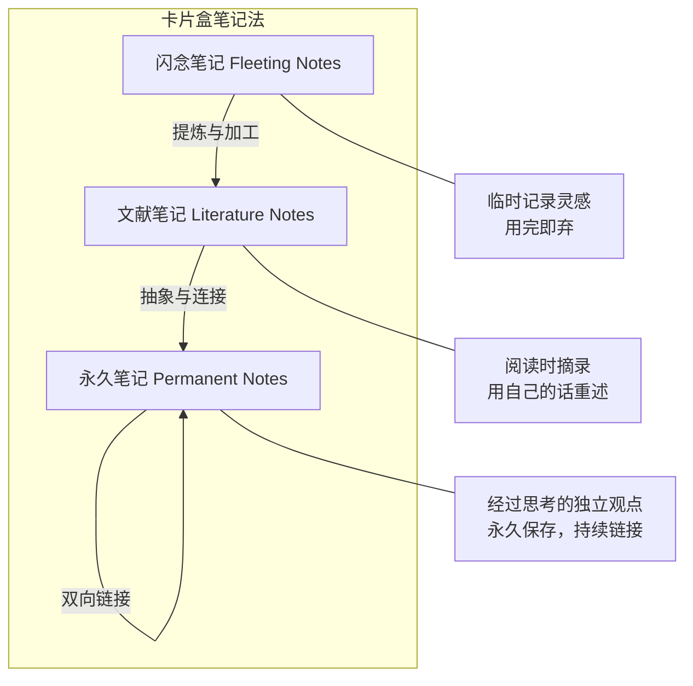
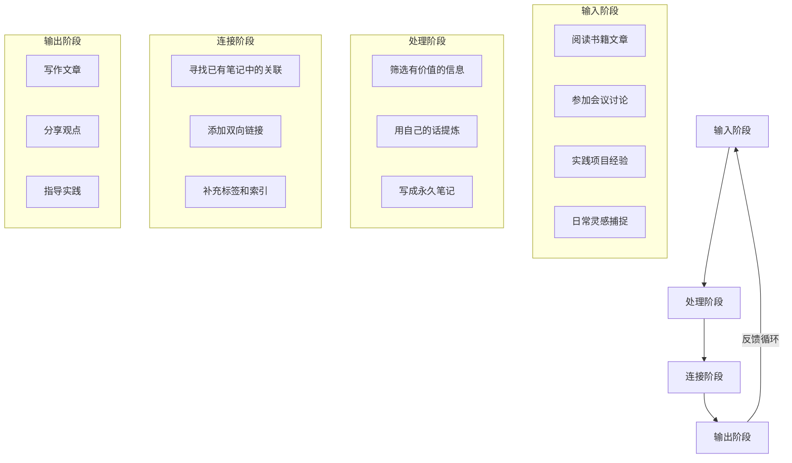
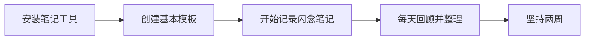
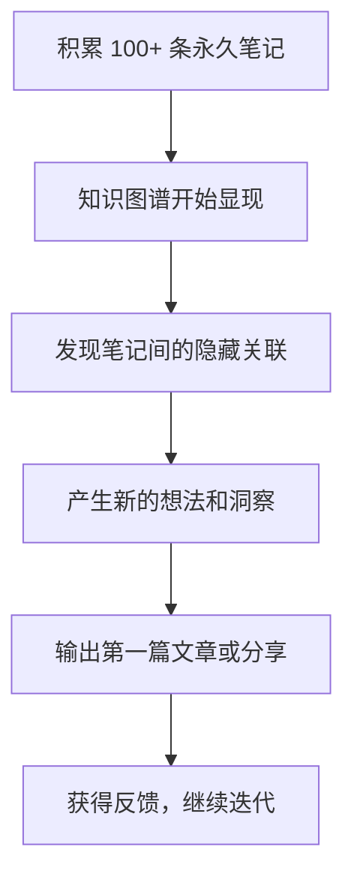

## 引言

你有没有这样的经历：读到一篇精彩的文章，随手收藏到书签夹，然后再也没有打开过；参加了一场干货满满的分享会，拍了满满一屏的照片，一周后就完全忘了讲了什么；在某个深夜突然冒出一个绝妙的灵感，醒来后却怎么也想不起来。

这不是记忆力的问题，而是**知识管理方式**的问题。我们每天都在消费大量信息，但绝大多数信息停留在"收藏即遗忘"的状态——它们以碎片的形式散落在浏览器书签、微信收藏、笔记 App 和大脑的某个角落里，彼此之间没有任何联系。

本文将探讨如何系统性地将这些信息碎片转化为结构化的知识网络，构建属于你自己的"第二大脑"。

## 信息过载时代的困境

我们生活在一个信息丰裕但注意力稀缺的时代。每天产生的信息量远超人类历史上任何时期，而我们的处理能力并没有随之增长。



艾宾浩斯遗忘曲线告诉我们，如果不主动复习，新学的知识在一周后会遗忘约 80%。而"收藏"这个动作给了我们一种虚假的安全感——"我收藏了就等于我掌握了"。实际上，收藏只是信息存储的第一步，距离真正的知识消化还有很长的路要走。

## DIKW 模型：从数据到智慧的阶梯

要理解知识管理的本质，首先要理解知识的层次结构。DIKW 模型（Data-Information-Knowledge-Wisdom）提供了一个清晰的框架：



大多数人的信息管理停留在"信息"层面——收藏了一堆文章、书签、截图，但没有进一步加工成"知识"。而真正的知识管理，核心工作就是完成从 Information 到 Knowledge 的转化。

### 转化的关键步骤

1. **筛选**：不是所有信息都值得保留。问自己："这条信息对我有什么用？它能解决什么问题？"
2. **提炼**：用自己的话重新表述，剥离冗余信息，保留核心观点
3. **关联**：将新信息与已有知识建立连接，思考"这和我已知的什么知识相关？"
4. **应用**：将知识应用到实际场景中，在实践中验证和深化理解

## 卡片盒笔记法（Zettelkasten）

### 起源与核心理念

卡片盒笔记法（Zettelkasten）由德国社会学家尼克拉斯·卢曼发明。卢曼用这套方法管理了超过 90,000 张卡片，产出了 70 多本著作和 400 多篇论文。它的核心理念是：**知识不是孤立存在的，而是通过链接形成网络。**

卢曼的成功不在于他的记忆力或智商，而在于他建立了一套系统——一个能够自动产生新想法的"思维机器"。

### 卡片盒的三种卡片



**1. 闪念笔记（Fleeting Notes）**

随手记录的灵感、想法、片段。不需要精心组织，关键是快速捕获。可以使用手机备忘录、语音输入或任何随手可得的工具。闪念笔记的寿命很短——通常在 1-2 天内就会被处理或丢弃。

**2. 文献笔记（Literature Notes）**

阅读书籍、文章时做的笔记。关键原则是**用自己的话重述**，而不是简单复制粘贴。每条文献笔记只记录一个观点，并标注来源。

```markdown
---
type: literature
source: '《卡片笔记写作法》'
author: 'Sönke Ahrens'
created: 2026-03-15
tags: [读书笔记, 知识管理]
---

# 卡片笔记写作法 - 文献笔记

## 核心观点

写作不是思考的结果，而是思考的工具。卢曼不是先想清楚再写，
而是通过写卡片来"想清楚"。

## 我的思考

这解释了为什么"写出来"和"想明白"往往是同步发生的。
写作本身就是一种认知过程，而不仅仅是认知结果的输出。
```

**3. 永久笔记（Permanent Notes）**

经过深思熟虑的独立观点。每条永久笔记都是一个完整的、自包含的思想单元，用清晰的文字写就，并与其他笔记建立链接。永久笔记是知识网络中的"节点"。

```markdown
---
type: permanent
created: 2026-03-16
tags: [写作, 思考, 认知科学]
related: [[卡片笔记写作法]], [[费曼学习法]]
---

# 写作即思考

写作不仅仅是表达已有想法的工具，它本身就是一种认知过程。
当我们试图将模糊的直觉转化为清晰的文字时，大脑被迫进行
精确的逻辑组织和概念界定。

这解释了几个常见现象：

- "我以为我懂了，但写不出来"——说明理解还不够深入
- "写着写着就想通了"——写作推动了认知的深化
- "教是最好的学"——向他人解释（一种写作形式）迫使你理清逻辑

**关联**：这与 [[费曼学习法]] 的核心思想一致——如果你不能用简单的
语言解释一个概念，说明你还没有真正理解它。

**应用**：不要等到"想清楚"再动笔。先写，在写的过程中"想清楚"。
```

### 卡片盒笔记法的核心原则

1. **原子性**：每条笔记只包含一个观点。这样才方便自由组合和链接
2. **自主性**：用自己的话写，不依赖原文。如果你不能用自己的话复述，说明你还没有理解
3. **链接性**：主动为笔记建立链接。链接越多，知识网络越丰富
4. **不分类**：不用文件夹分类，而是通过链接和标签让笔记自然组织

## 知识图谱的构建方法

### 从笔记到图谱

知识图谱不是一蹴而就的，它随着你的笔记积累自然生长。但你可以通过以下方法加速它的形成：



### 知识图谱的三种结构

| 结构类型     | 描述                            | 价值               |
| ------------ | ------------------------------- | ------------------ |
| **层级结构** | 父子关系，如"前端 → CSS → 架构" | 提供知识的宏观框架 |
| **关联结构** | 主题之间的横向联系              | 产生跨领域洞察     |
| **序列结构** | 知识的时间线或流程              | 展示知识的演化路径 |

一个成熟的知识图谱应该同时包含这三种结构。层级结构让你快速定位知识，关联结构帮你发现隐藏的联系，序列结构让你追踪知识的来龙去脉。

### 加速图谱生长的技巧

1. **每日回顾**：每天花 10 分钟浏览最近的笔记，寻找可以建立链接的地方
2. **索引笔记**：创建"入口笔记"（MOC，Map of Content），作为某个主题的导航页
3. **定期整理**：每周花 30 分钟清理闪念笔记，将有价值的提炼为永久笔记
4. **主动提问**：读完一篇文章后，问自己"这和我已知的什么知识有关联？"

```markdown
---
type: moc
created: 2026-04-01
tags: [索引, 知识管理]
---

# 知识管理 - 主题索引

## 核心方法

- [[卡片盒笔记法]] —— 卢曼的笔记系统
- [[费曼学习法]] —— 以教促学
- [[DIKW 模型]] —— 知识的层次结构

## 工具与实践

- [[Notion + Obsidian 双轨知识管理系统]]
- [[个人知识图谱构建]]

## 延伸阅读

- [[AI 时代知识工作者的生存指南]]
```

## 工具推荐

### 核心工具

| 工具          | 类型       | 核心优势                           | 适合人群             |
| ------------- | ---------- | ---------------------------------- | -------------------- |
| **Obsidian**  | 本地笔记   | 双向链接、图谱可视化、插件生态丰富 | 注重知识网络构建的人 |
| **Logseq**    | 本地笔记   | 大纲式笔记、双向链接、开源免费     | 喜欢大纲结构的用户   |
| **Notion**    | 云端协作   | 数据库、团队协作、模板丰富         | 需要团队协作的用户   |
| **Heptabase** | 可视化笔记 | 白板式知识组织、空间化思考         | 视觉型思考者         |
| **Readwise**  | 阅读同步   | 自动同步各平台标注到笔记工具       | 大量阅读的用户       |

### 辅助工具

| 工具             | 用途       | 说明                                 |
| ---------------- | ---------- | ------------------------------------ |
| **Omnivore**     | 稍后阅读   | 开源免费的稍后阅读工具，支持高亮标注 |
| **MarkDownload** | 网页保存   | 将网页保存为 Markdown 格式           |
| **Dataview**     | 笔记查询   | Obsidian 插件，用类 SQL 语法查询笔记 |
| **Excalidraw**   | 可视化思考 | Obsidian 插件，手绘图表和思维导图    |

> **工具选择的建议**：不要陷入"工具焦虑"。工具只是载体，核心是你的思考方式。建议先用一个工具（推荐 Obsidian）坚持使用三个月，再根据实际需求决定是否需要补充其他工具。关于工具搭配的具体方案，可以参考 [Notion + Obsidian 双轨知识管理系统](/blog/notion-obsidian-dual-track)。

## 实践路线图

如果你准备开始构建自己的知识图谱，建议按以下路线图逐步推进：

### 第一阶段：建立习惯（第 1-2 周）



- 选择一个笔记工具并安装
- 创建 3 个基本模板：闪念笔记、文献笔记、永久笔记
- 每天至少记录 3 条闪念笔记
- 每天花 10 分钟回顾和整理

### 第二阶段：积累笔记（第 3-6 周）

- 开始系统性地阅读，每本书/文章至少产出 3 条文献笔记
- 将有价值的文献笔记提炼为永久笔记
- 为每条永久笔记寻找至少 1 个关联笔记
- 创建第一个主题索引（MOC）

### 第三阶段：构建网络（第 2-3 个月）



- 永久笔记数量达到 100 条以上
- 定期浏览知识图谱，发现意外的关联
- 尝试基于笔记网络输出一篇文章或分享
- 根据反馈调整笔记方法

### 第四阶段：持续进化（第 3 个月以后）

- 建立稳定的输入-处理-输出循环
- 定期回顾和更新旧的永久笔记
- 探索自动化工具（如 Dataview 查询、模板自动化）
- 将知识图谱应用于实际工作和学习

## 总结

构建个人知识图谱不是一蹴而就的项目，而是一种需要长期坚持的**思维习惯**。它的核心不是工具，不是方法，而是**对知识保持敬畏和好奇的态度**——每一次阅读、每一次思考、每一次实践，都是在为你的知识网络添加新的节点和连接。

从信息碎片到知识网络，关键在于三个转化：**从被动收藏到主动提炼**，**从孤立存储到建立链接**，**从知识积累到实践输出**。当你完成了这三个转化，你就拥有了真正的"第二大脑"——一个能够持续产生洞察和创意的知识系统。

> "知识不是你收藏了多少信息，而是你能在不同的知识之间建立多少有意义的连接。"

正如我们在 [AI 时代知识工作者的生存指南](/blog/ai-era-knowledge-worker) 中所讨论的，在信息爆炸的时代，真正的竞争力不在于你掌握了多少信息，而在于你能否将信息转化为可复用的知识，并在此基础上产生独特的洞察。个人知识图谱，正是实现这一目标的最有效路径。

---

_相关阅读：[Notion + Obsidian 双轨知识管理系统](/blog/notion-obsidian-dual-track) —— 知识图谱的落地工具方案_
