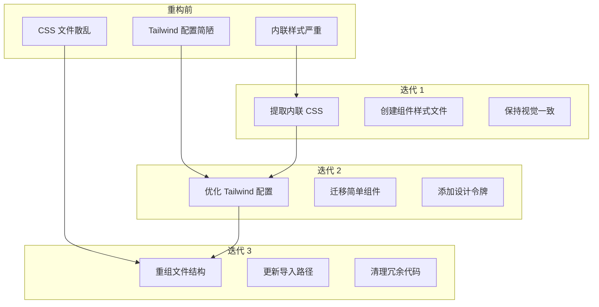

## 引言

在软件开发中，重构是一个永恒的话题。但重构最容易犯的错误就是"追求完美主义"——试图一次性重写整个代码库，结果导致项目延期甚至失败。

本文将分享我在 **祈研所网站** 重构过程中的完整实践经验：如何通过三个迭代周期，从内联 CSS 逐步迁移到优化的 Tailwind 架构，过程中踩过哪些坑，以及如何通过渐进式策略把风险降到最低。




## 为什么选择渐进式重构？

重构的最大敌人是"全部重写"的诱惑。在我分析项目后，发现了三个主要问题：

| 问题                           | 风险 | 为什么不能一次性解决                 |
| ------------------------------ | ---- | ------------------------------------ |
| 首页有 170+ 行内联 `<style>`   | 高   | 直接删除内联样式会导致大面积样式崩坏 |
| 多个组件都有自己的内联样式     | 中   | 逐个迁移需要时间，但风险可控         |
| CSS 文件组织松散，缺乏清晰结构 | 低   | 移动文件相对安全，但需要更新所有引用 |

**渐进式重构的核心优势：**

1. **风险隔离**：每个迭代都有明确的边界，出错范围可控
2. **快速反馈**：每个迭代完成后可以立即验证效果
3. **可暂停**：如果中途有其他紧急任务，可以随时暂停
4. **学习机会**：通过实际操作逐步理解最佳实践

## 迭代 1：提取内联样式

### 目标

将所有组件和页面中的内联 `<style>` 标签提取到外部 CSS 文件中，保持视觉效果完全一致。

### 执行过程

#### 步骤 1：审计内联样式

首先，我需要知道项目中到底有多少内联样式：

```bash
# 查找所有包含 <style> 标签的 .astro 文件
grep -r "<style" src/ --include="*.astro"
```

结果发现：

- 首页 (`src/pages/index.astro`)：170 行内联样式
- `ThemeToggle.astro`：主题切换按钮的完整样式
- `LanguageToggle.astro`：语言切换组件样式
- `DashCard.astro`：仪表卡片组件样式

#### 步骤 2：创建对应的 CSS 文件

我为每个有内联样式的组件创建了对应的 CSS 文件：

```css
/* src/styles/page-home.css - 首页专用样式 */
/* 完整复制 index.astro 中的 <style> 内容 */
```

```css
/* src/styles/component-theme-toggle.css - 主题切换按钮样式 */
/* 从 ThemeToggle.astro 中完整提取 */
```

#### 步骤 3：更新组件引用

修改组件文件，删除内联 `<style>`，改为 import 外部 CSS：

```astro
---
// 修改前
---

<!-- 组件内容 -->
<style>
  /* 100+ 行内联样式 */
</style>

--- // 修改后 import "../styles/component-name.css"; ---
<!-- 组件内容 -->
<!-- 不再有 <style> 标签 -->
```

### 踩过的坑

**坑 #1：CSS 作用域丢失**
在 Astro 中，内联 `<style>` 标签默认是**组件作用域**的（类似 Vue 的 scoped）。但提取到外部 CSS 文件后，这些样式变成了**全局作用域**！

**解决方案**：

1. 确保每个 CSS 文件中的类名都有独特前缀（如 `.theme-toggle-*`）
2. 或者使用 Astro 的 CSS Modules 功能（但这需要更多改动）
3. 我们选择了前缀方案，因为风险更低

**坑 #2：`@import` 路径问题**
在提取的 CSS 文件中，如果有 `@import` 引用，路径需要重新计算！

**解决方案**：

- 确保所有 `@import` 都是从文件所在位置计算的相对路径
- 或者直接使用从 `src/styles/` 出发的路径

### 验收标准

- ✅ 所有内联 `<style>` 标签都已移到外部文件
- ✅ 构建成功，无样式错误
- ✅ 视觉效果保持完全一致（亮色/深色模式都要验证）

#### 验证方法

```bash
npm run build
# 如果 build 成功，基本就没问题了！
```

## 迭代 2：Tailwind 集成优化

### 目标

优化 Tailwind 配置，将简单组件迁移到 Tailwind 工具类，同时保持设计系统的一致性。

### 执行过程

#### 步骤 1：完善 Tailwind 配置

原来的 `tailwind.config.mjs` 非常简陋，只定义了几个颜色。我大幅扩展了它：

```javascript
// tailwind.config.mjs
export default {
  content: ['./src/**/*.{astro,html,js,jsx,md,mdx,svelte,ts,tsx,vue}'],
  theme: {
    extend: {
      // 语义化颜色（引用设计令牌）
      colors: {
        primary: 'var(--qi-brand-emerald)',
        text: {
          primary: 'var(--qi-text-primary)',
          secondary: 'var(--qi-text-secondary)',
          muted: 'var(--qi-text-muted)',
        },
        bg: {
          base: 'var(--qi-bg-base)',
          surface: 'var(--qi-surface-main)',
        },
        border: {
          default: 'var(--qi-border-default)',
        },
        // 完整的颜色系列
        emerald: { 50: '...', 100: '...', /* ... */ 900: '...' },
      },
      // 其他设计令牌映射
      fontFamily: { sans: 'var(--qi-font-sans)' /* ... */ },
      spacing: { xs: 'var(--qi-space-xs)' /* ... */ },
      borderRadius: { md: 'var(--qi-radius-md)' /* ... */ },
      boxShadow: { sm: 'var(--qi-shadow-sm)' /* ... */ },
    },
  },
  plugins: [],
};
```

#### 步骤 2：在 `tailwind.css` 中添加自定义组件类

对于需要特殊动画或复杂选择器的样式，我在 `tailwind.css` 中使用 `@layer components`：

```css
@tailwind base;
@tailwind components;
@tailwind utilities;

@layer components {
  /* 主题切换按钮的图标动画类 */
  .theme-icon-sun {
    opacity: 0;
    transform: rotate(-90deg) scale(0.5);
  }

  .theme-icon-moon {
    opacity: 1;
    transform: rotate(0deg) scale(1);
  }

  .dark .theme-icon-sun {
    opacity: 1;
    transform: rotate(0deg) scale(1);
  }

  .dark .theme-icon-moon {
    opacity: 0;
    transform: rotate(90deg) scale(0.5);
  }

  /* 动画关键帧 */
  @keyframes fillIn {
    from {
      width: 0%;
    }
  }

  @keyframes fadeUp {
    from {
      opacity: 0;
      transform: translateY(4px);
    }
    to {
      opacity: 1;
      transform: translateY(0);
    }
  }

  .animate-fillIn {
    animation: fillIn 1.2s var(--qi-spring) forwards;
  }
  .animate-fadeUp {
    animation: fadeUp 0.5s ease 0.8s forwards;
  }
}
```

#### 步骤 3：逐个迁移组件

**ThemeToggle 组件迁移：**

```astro
<!-- 迁移前 -->
<button class="theme-toggle">...</button>

<!-- 迁移后 -->
<button
  class="inline-flex items-center justify-center w-8 h-8 p-0 bg-transparent
               border border-[var(--qi-base-06)] rounded-md cursor-pointer
               text-text-secondary hover:text-text-primary
               hover:bg-[var(--qi-base-04)] hover:border-[var(--qi-base-08)]
               focus-visible:outline-none focus-visible:outline-2
               focus-visible:outline-offset-2 focus-visible:outline-primary
               transition-colors duration-fast relative"
>
  ...
</button>
```

**DashCard 组件迁移：**
这个组件比较复杂，包含动态填充动画，我选择混合方案：

- 布局和基础样式用 Tailwind
- 动态填充宽度通过 `style` 属性设置
- 关键动画类在 `tailwind.css` 中定义

### 踩过的坑

**坑 #3：设计令牌在 Tailwind 中的正确使用**
一开始我直接写 `bg-qi-brand-emerald`，但这完全不生效！

**原因**：Tailwind 不会自动识别 CSS 自定义属性作为颜色值。

**解决方案**：
在 `tailwind.config.mjs` 中定义语义化颜色别名，然后使用 `text-primary`、`bg-primary` 等。

**坑 #4：动画性能问题**
在迁移 DashCard 时，我发现动画在某些浏览器中有卡顿。

**原因**：使用了 `width` 属性做动画，这会触发重排（reflow）。

**解决方案**：

1. 对于简单动画，使用 `transform` 和 `opacity` 代替
2. 对于这个特定场景，`width` 是必需的，所以添加了 `will-change: width` 提示浏览器优化
3. 保持了原有的 spring easing 动画曲线，确保视觉效果一致

**坑 #5：暗色模式类名的正确写法**
Tailwind 的暗色模式通过 `dark:` 前缀工作，但需要确保：

```html
<!-- ❌ 错误写法 -->
<div class="bg-white dark:bg-gray-900"></div>

<!-- ✅ 正确写法（配合我们的设计令牌） -->
<div class="bg-bg-base"></div>
<!-- 令牌内部已经处理了暗色模式！ -->
```

### 迁移策略总结

我发现了一个有效的迁移策略：

| 组件类型         | 迁移方案                | 示例                            |
| ---------------- | ----------------------- | ------------------------------- |
| **简单按钮**     | 完全用 Tailwind         | `ThemeToggle`、`LanguageToggle` |
| **复杂动画组件** | Tailwind + 自定义组件类 | `DashCard`                      |
| **布局组件**     | 保持现有 CSS（暂不动）  | `Navigation`、`Footer`          |
| **页面区块**     | 保持现有 CSS（暂不动）  | `HeroSection`、`AboutSection`   |

**核心原则**：先迁移简单的、独立的组件，复杂的页面级样式可以后处理。

## 迭代 3：CSS 文件结构重组

### 目标

重新组织 CSS 文件结构，建立更清晰、更易维护的架构。

### 执行过程

#### 步骤 1：设计新的目录结构

参考 ITCSS 方法论，我设计了一个清晰的分层结构：

```
src/styles/
├── base/              # 基础样式
│   ├── reset.css
│   ├── tokens.css
│   ├── dark-tokens.css
│   └── global.css
├── components/        # 组件样式
│   ├── navigation.css
│   ├── footer.css
│   └── search-modal.css
├── sections/          # 页面区块样式
│   ├── home-hero.css
│   ├── home-about.css
│   ├── article.css
│   ├── error.css
│   └── home-responsive.css
└── utilities/         # 工具类
    ├── utilities.css
    ├── animations.css
    └── code-blocks.css
```

#### 步骤 2：移动文件

这一步看起来简单，但需要小心！

```bash
# 创建新目录
mkdir -p src/styles/{base,components,sections,utilities}

# 移动基础样式
mv src/styles/reset.css src/styles/tokens.css src/styles/dark-tokens.css src/styles/global.css src/styles/base/

# 移动组件样式
mv src/styles/navigation.css src/styles/footer.css src/styles/search-modal.css src/styles/components/

# 移动区块样式
mv src/styles/home-*.css src/styles/hero-float-cards.css src/styles/about.css src/styles/article.css src/styles/error.css src/styles/sections/

# 移动工具类
mv src/styles/utilities.css src/styles/animations.css src/styles/code-blocks.css src/styles/utilities/
```

#### 步骤 3：批量更新引用路径

这是最繁琐的一步！我需要更新所有导入语句：

**BaseLayout.astro 中：**

```javascript
// 修改前
import '../styles/global.css';

// 修改后
import '../styles/base/global.css';
```

**其他组件中：**

```javascript
// Navigation.astro
import "../styles/components/navigation.css"; // 原来是 navigation.css

// Footer.astro
import "../styles/components/footer.css"; // 原来是 footer.css

// SearchModal.astro
@import "../styles/components/search-modal.css"; // 原来是 search-modal.css
```

**CSS 文件内部的 `@import` 也需要更新！**

```css
/* src/styles/base/global.css */
/* 修改前 */
@import './tailwind.css';
@import './tokens.css';
@import './hero-float-cards.css';

/* 修改后 */
@import '../tailwind.css';
@import './tokens.css';
@import '../sections/hero-float-cards.css';
@import '../utilities/utilities.css';
/* ... 更多路径调整 ... */
```

### 踩过的坑

**坑 #6：路径引用的连锁反应**
当我移动一个 CSS 文件后，这个文件内部的 `@import` 路径也需要更新，而被它引用的文件如果也被移动了，又需要继续更新...

**解决方案**：

1. 先移动最底层的文件（不引用其他文件的）
2. 然后移动中间层
3. 最后移动顶层文件
4. 每次移动后立即运行 `npm run build` 验证

**坑 #7：git mv vs 手动 mv**
一开始我直接用 `mv` 命令移动文件，结果 git 把它们识别为"删除+新建"，而不是"重命名"。

**解决方案**：

```bash
# 使用 git mv 可以保留文件历史
git mv src/styles/old-path.css src/styles/new-path.css
```

不过，由于我们之前已经完成了重构并提交了，这个问题在我们的案例中没有出现。

**坑 #8：VS Code 自动补全的误导**
VS Code 的路径自动补全有时候会给错误的建议，特别是当文件刚刚被移动时。

**解决方案**：

1. 每次移动文件后，重启 TypeScript 服务器（在 VS Code 中按 `Cmd+Shift+P`，选择 "TypeScript: Restart TS Server"）
2. 或者直接手动写路径，然后通过 build 验证

## 完整的重构技术栈总结

### 我们用到的工具

| 工具                 | 用途                         | 评价                        |
| -------------------- | ---------------------------- | --------------------------- |
| **Git**              | 版本控制，每个迭代完成后提交 | ⭐⭐⭐⭐⭐ 必备             |
| **npm run build**    | 快速验证重构是否正确         | ⭐⭐⭐⭐⭐ 每次修改后必运行 |
| **Astro Dev Server** | 本地预览，检查视觉效果       | ⭐⭐⭐⭐ 快速反馈           |
| **设计令牌系统**     | 保持设计一致性               | ⭐⭐⭐⭐⭐ 这次重构的基础   |
| **Tailwind CSS**     | Utility-First 样式方案       | ⭐⭐⭐⭐ 组件迁移的核心     |

### 三个迭代的验收清单

```markdown
✅ 迭代 1：
[x] 所有内联 <style> 已提取
[x] 组件引用已更新
[x] 构建成功
[x] 视觉效果一致（亮色/深色模式）

✅ 迭代 2：
[x] Tailwind 配置已完善
[x] 简单组件已迁移
[x] 自定义组件类已添加
[x] 动画效果保持一致

✅ 迭代 3：
[x] 新目录结构已创建
[x] 所有文件已移动
[x] 所有 import 路径已更新
[x] 构建成功无错误
[x] 所有页面正常显示
```

## 心得体会与最佳实践

### 1. 渐进式重构的四个原则

**原则 1：每次只做一件事**

- 迭代 1：只提取内联 CSS，不修改任何样式逻辑
- 迭代 2：只优化 Tailwind 和迁移简单组件，不重组文件
- 迭代 3：只重组文件结构，不修改样式内容

**为什么重要**：如果你同时修改样式和移动文件，出错时很难定位是哪个环节出了问题。

**原则 2：频繁验证，快速反馈**

```bash
# 我的重构工作流
git status              # 检查当前状态
# ... 修改代码 ...
npm run build           # 立即验证
git add -u              # 暂存修改
git commit -m "..."     # 完成一个小步骤后立即提交
```

每次提交都应该是一个"稳定点"——可以正常构建、功能完整的版本。

**原则 3：不要追求完美主义**

- 我们没有把所有组件都迁移到 Tailwind
- 我们没有删除所有"旧"的 CSS 文件
- 我们保持了原有的设计令牌系统不动

**原因**：重构的目标是"改善"，不是"完美"。把风险高的部分留到以后，先解决风险低、收益高的问题。

**原则 4：记录每一步（写文档）**
在重构过程中，我同时写了详细的计划文档（`progressive-refactor-plan.md`）。这带来两个好处：

1. 让自己思路更清晰
2. 以后回顾时知道当时为什么做这些决策

### 2. 什么时候应该用 Tailwind，什么时候应该保留传统 CSS？

这是我在重构过程中反复思考的问题。我的结论是：

**适合用 Tailwind 的场景：**

- ✅ 简单的 UI 组件（按钮、开关、卡片）
- ✅ 一次性的布局调整（不需要复用的）
- ✅ 响应式设计（Tailwind 的响应式前缀太方便了）
- ✅ 状态样式（hover、focus、active）

**适合保留传统 CSS 的场景：**

- ❌ 复杂的动画和过渡（需要关键帧）
- ❌ 复杂的选择器逻辑（`:nth-child`、`:has()` 等）
- ❌ 需要大量使用设计令牌的地方（保持语义化更清晰）
- ❌ 已经稳定、不需要经常修改的组件

### 3. Git 在重构中的最佳实践

**提交信息的格式建议：**

```
refactor(iter1): extract inline styles from index.astro
refactor(iter2): migrate ThemeToggle to Tailwind
refactor(iter3): reorganize CSS file structure
```

**分支策略（可选但推荐）：**

```bash
git checkout -b refactor/progressive-css
# 完成一个迭代后
git checkout main
git merge refactor/progressive-css
```

不过在我们的案例中，由于是个人项目且每次迭代后都验证成功，我们直接在 main 分支上工作。

### 4. 重构过程中的心理建设

重构往往没有"可见的功能变化"，这很容易让人产生挫败感。我的建议是：

1. **设置小里程碑**：每个迭代完成后给自己一点小奖励
2. **记录你的进展**：用 TODO list 或者文档记录已完成的工作
3. **关注长期价值**：重构的收益在未来——下次改代码时你会感谢现在的自己

## 重构后的架构优势

现在我们的项目有了这些改进：

### 1. 更清晰的文件结构

```
旧结构：所有 CSS 混在 src/styles/ 下
新结构：按 base/components/sections/utilities 分层
```

### 2. 更灵活的技术选型

- 可以用 Tailwind 开发新组件
- 可以继续用传统 CSS 维护旧组件
- 两者可以混合使用，互不干扰

### 3. 更好的开发体验

- Tailwind 的自动补全让写样式更快
- 清晰的文件结构让找样式更容易
- 设计令牌保持了设计一致性

### 4. 更低的维护成本

- 每个文件职责单一
- 修改一个样式时，影响范围明确
- 组件样式与页面样式分离

## 总结

渐进式重构不是"懒人的方法"，而是"聪明人的策略"。它承认一个现实：我们无法一次性预见所有问题，所以通过小步快跑、频繁验证的方式，把风险降到最低。

在这次重构中，我们：

1. ✅ 没有破坏任何现有功能
2. ✅ 没有出现大面积样式崩坏
3. ✅ 每一步都有明确的验收标准
4. ✅ 最终代码质量显著提升

如果你正在考虑重构你的项目，我强烈建议你：

- 不要追求"一步到位"
- 把大任务拆分成多个小迭代
- 每个迭代后都要验证
- 记录你的过程和思考

最后，记住这句话：**"重构的目的不是让代码变得'完美'，而是让代码变得'更容易被继续改进'。"**

---

_相关阅读：[可扩展的 CSS 架构：从 BEM 到设计令牌的演进](/blog/css-architecture-scalable-projects) —— 了解我们重构背后的方法论基础_

_相关阅读：[从零构建设计令牌系统](/blog/design-tokens-system-guide) —— 深入了解项目中使用的设计令牌系统_
